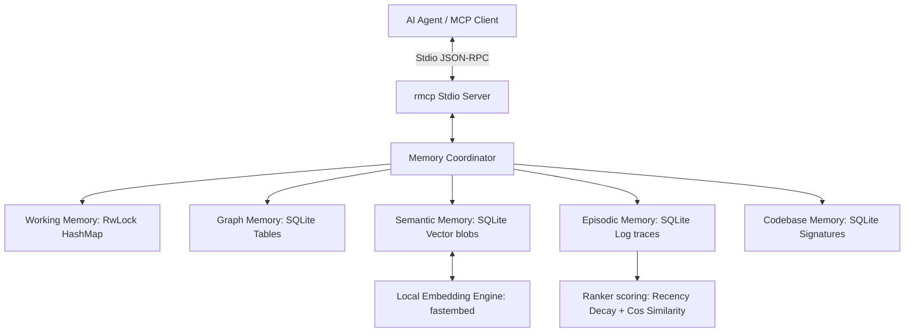

# memory_rs

<p align="center">
  
</p>

`memory_rs` is a high-performance, cognitive-inspired Model Context Protocol (MCP) memory server written in Rust. Designed to replace simple graph-based memory layers, it integrates a **5-tier cognitive memory architecture** alongside vector search, recency decay, and episodic logs, powered locally by SQLite and ONNX Runtime.

---

## 📖 Documentation Index
For in-depth guides on systems design and deployment details, view the documents in the `docs/` folder:
* 🖥️ **Interactive Diagram**: [docs/architecture.html](docs/architecture.html) (Standalone SVG/CSS Card)
* 🧠 **System Architecture**: [docs/architecture.md](docs/architecture.md) (Memory Layers & SQLite Tables)
* ⚡ **Engine Features**: [docs/features.md](docs/features.md) (Ranking Equations & Local Embedding Specs)
* 📁 **Codebase Structure**: [docs/codebase.md](docs/codebase.md) (Source Code Modules & Build Guide)

---

## ⚡ Core Upgrades over standard Memory Server

1. **5 Cognitive Memory Layers**: Combines session RAM (Working Memory), structured relations (Graph Memory), local vector embeddings (Semantic Memory), task log traces (Episodic Memory), and codebase signatures (Codebase Memory) in a single workflow.
2. **Local Vector Search**: Embedded text search powered by ONNX Runtime (`all-MiniLM-L6-v2`) running locally on CPU. No cloud service calls, no token bills, and zero external network latencies.
3. **Temporal Recency Decay**: Implements mathematical decay ($e^{-\lambda t}$) ensuring that old, stale facts fade away in score unless marked with high importance.
4. **Normalized SQLite Persistence**: Eliminates reading/writing flat JSON files on disk. Employs transaction-safe, row-indexed SQL databases (`memory.db`).
5. **Ultra-Low Resource Usage**: Compiles to a single static native binary using <10MB of RAM idle, with instant startup.

---

## ⚖️ Comparison: reference TS Memory vs. `memory_rs`

`memory_rs` is inspired by the official Model Context Protocol TypeScript memory server (available at [github.com/modelcontextprotocol/servers/memory](https://github.com/modelcontextprotocol/servers/tree/main/src/memory)), but expands it with advanced capabilities:

| Feature / Metric | Reference TypeScript MCP Server | `memory_rs` (Rust Engine) |
| :--- | :--- | :--- |
| **Language** | TypeScript / Node.js | Pure Rust |
| **Storage Backend** | Flat JSON file (reads/writes full file) | SQLite database (`memory.db`) |
| **Execution Performance** | High overhead from Node.js and full-file parsing | High-performance, compile-optimized native binary |
| **Memory Footprint** | ~50MB - 100MB RAM | <10MB RAM (idle, sans models) |
| **Startup Time** | Slow (Node.js engine loading dependencies) | Sub-millisecond instant load |
| **Concurrency Safeguard** | No built-in locking (prone to corruption on write overlap) | Safe `parking_lot::Mutex` thread locks |
| **Search Models** | Simple regex/exact keyword matching | Vector Similarity + Decay + Importance + Success Rank |
| **Embeddings Support** | ❌ None (No semantic context mapping) | ✅ Local ONNX Runtime (`all-MiniLM-L6-v2`) |
| **Decay & Recency** | ❌ None (All memories retain constant priority) | ✅ Exponential Temporal Decay ($e^{-0.01t}$) |
| **Memory Layers** | Single Layer: Graph Memory | 5 Cognitive Layers: Working, Graph, Semantic, Episodic, Codebase |
| **Reflections / Performance** | ❌ None (No logging of execution feedback) | ✅ Episodic task execution logs & reflections |
| **Code Workspace Index** | ❌ None (Unaware of project symbols) | ✅ Indexes class/struct signatures & dependencies |

---

## 🛠️ Architecture Overview

The system is coordinated via a centralized controller which maps incoming JSON-RPC calls over Stdio streams to respective SQLite tables, executing similarity ranking algorithms to find relevant context.



---

## ⚙️ Quickstart

### Prerequisites
* Rust compiler & Cargo toolchain.

### 1. Build the engine
Compile the release binary:
```bash
cargo build --release
```
The compiled executable will be located at:
`target/release/memory_rs`

### 2. Configure with your MCP Client (e.g. Claude Desktop)
Add the server configuration inside your client configuration file (e.g., `~/.config/Claude/claude_desktop_config.json`):

```json
{
  "mcpServers": {
    "memory": {
      "command": "/home/aswin/programming/vscode/myProjects/ai_agent_tools/memory_rs/target/release/memory_rs",
      "env": {
        "MEMORY_DB_PATH": "/home/aswin/programming/vscode/myProjects/ai_agent_tools/memory_rs/memory.db"
      }
    }
  }
}
```

### 3. Integrated Tools

The server implements all 9 graph-based operations required by standard MCP integrations:
* `create_entities`: Declare new entities with types and observations.
* `create_relations`: Create directed active-voice relations between nodes.
* `add_observations`: Add observations to existing entities.
* `delete_entities`: Safely remove nodes and all associated relations.
* `delete_observations`: Clear specific observations from entities.
* `delete_relations`: Delete relations.
* `read_graph`: Dump the entire relational knowledge graph.
* `search_nodes`: Search entities matching a keyword pattern.
* `open_nodes`: Directly read observations of entities by name.
