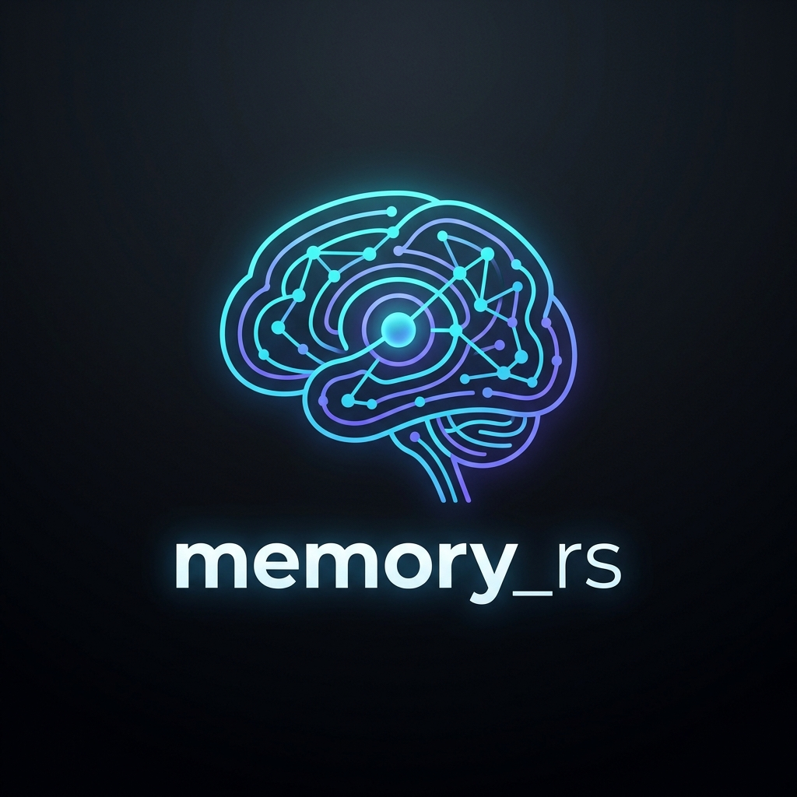
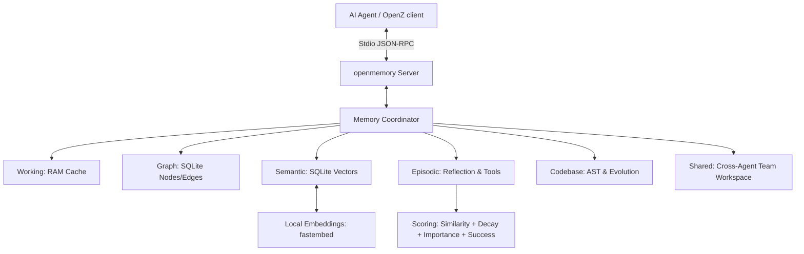

# openmemory_rs

<p align="center">
  
</p>

`openmemory_rs` is a high-performance, unified cognitive memory engine for AI agent frameworks like **OpenZ**, implemented natively in Rust. It combines structured knowledge graphs, local vector embeddings, AST codebase analysis, episodic task reflections, and synchronized team workspaces into a single, high-performance local server.

---

## 📖 Documentation Index
For deep-dive specification sheets and code module mappings, view the documents in the `docs/` folder:
* 🖥️ **Interactive Diagram**: [docs/architecture.html](docs/architecture.html) (Interactive standalone SVG/CSS card)
* 🧠 **System Architecture**: [docs/architecture.md](docs/architecture.md) (6 Cognitive Layers & 9 SQLite tables spec)
* ⚡ **Engine Features**: [docs/features.md](docs/features.md) (Ranking equations, decay formulas, codebase analysis details)
* 📁 **Codebase Structure**: [docs/codebase.md](docs/codebase.md) (Source code modules, dependencies, compile guide)

---

## 🚀 Key Features

* **6 Cognitive Memory Layers**: Integrated session RAM (Working Memory), relations (Graph Memory), local vectors (Semantic Memory), task execution feedback loops (Episodic Memory), static codebase trees (Codebase Memory), and shared agent workspaces (Shared Memory).
* **AST Codebase & Dependency Graphs**: Static AST symbol parsing for Rust, Python, Go, and JS/TS. Evaluates structs, functions, parent scopes, and caller hierarchies locally.
* **Episodic Learning & Reflection**: Tracks task status (Success/Failure), attempt traces, error root-causes, and reflections to guide future attempts.
* **Tool & Model Performance Metrics**: Monitors tool/model usage counts, latencies, and success ratios to help agents choose optimal models dynamically.
* **Multi-Agent Shared workspace**: Syncs variables and shared facts across multiple parallel subagent instances.
* **Temporal Recency Decay**: Implements mathematical decay ($e^{-\lambda t}$) prioritizing fresh or manually marked important context.
* **100% Offline Vector Search**: Runs embeddings locally on CPU using ONNX Runtime (`all-MiniLM-L6-v2`) with zero external API calls.
* **Local Persistence**: Saves all structural layers in a unified transaction-safe SQLite database (`memory.db`).

---

## ⚖️ Comparative Overview

`openmemory_rs` merges features from three reference architectures into a single, high-performance native engine:

| Attribute | Memory MCP (TypeScript Reference) | Supermemory MCP | Codebase-Memory MCP | `openmemory_rs` (Rust Engine) |
| :--- | :--- | :--- | :--- | :--- |
| **Language** | TypeScript / Node.js | TypeScript / Deno | Go / C | **Pure Rust** |
| **Persistence** | Flat JSON (Full file parse) | Remote cloud vector store | Local SQLite | **Local SQLite (`memory.db`)** |
| **AST Parse** | ❌ None | ❌ None | ✅ Tree-sitter | **✅ Native Codebase Parser** |
| **Vectors/Embed** | ❌ None | ✅ Cloud Embeddings | ❌ None | **✅ Local ONNX (`all-MiniLM-L6`)** |
| **Episodic Reflection**| ❌ None | ❌ None | ❌ None | **✅ Log attempts, root-causes** |
| **Team Share** | ❌ None | ❌ None | ❌ None | **✅ Cross-agent team boards** |
| **Tool Performance** | ❌ None | ❌ None | ❌ None | **✅ Tracks model & tool latencies** |
| **Startup / RAM** | Slow / ~80MB RAM | Slow / Cloud dependent | Fast / ~30MB RAM | **Sub-ms / <10MB RAM** |

---

## 🛠️ System Architecture

The core coordinator routes incoming JSON-RPC calls over Stdio streams to the corresponding memory layer, updating SQLite tables and calculating vector cosine similarity scores on demand.



---

## ⚙️ Quickstart

### 1. Compile the Release Crate
Ensure you have the Rust compiler and Cargo toolchain installed:
```bash
cargo build --release
```
The compiled native executable will be written to:
`target/release/openmemory_rs`

Install it to your local user binary directory for stable execution:
```bash
mkdir -p ~/.local/bin
cp target/release/openmemory_rs ~/.local/bin/openmemory_rs
```

### 2. Configure with your MCP Client (e.g. Claude Desktop)
Add the configuration into your client's config file (e.g., `~/.config/Claude/claude_desktop_config.json`):

```json
{
  "mcpServers": {
    "openmemory": {
      "command": "/home/aswin/.local/bin/openmemory_rs",
      "env": {
        "MEMORY_DB_PATH": "/home/aswin/programming/vscode/myProjects/ai_agent_tools/memory_rs/memory.db"
      }
    }
  }
}
```

---

## 🔌 Exposed MCP Tools

`openmemory_rs` registers 19 comprehensive tools categorized by cognitive layers:

### 1. Knowledge Graph Tools
* `create_entities`: Create nodes with entity types and observations.
* `create_relations`: Link entities with active-voice connections.
* `add_observations`: Append observations to existing nodes.
* `delete_entities` / `delete_observations` / `delete_relations`: Delete nodes/edges.
* `read_graph`: Retrieve the full entity-relationship graph.
* `search_nodes`: Filter nodes matching keyword pattern matching.
* `open_nodes`: Retrieve observation records of nodes by name.

### 2. Code Intelligence Tools
* `index_codebase`: Index files under a path into codebase AST elements and calls.
* `query_code_graph`: Find indexed functions, structs, parent blocks, and signatures.
* `log_repository_evolution`: Track file changes, commits, versions, and bug status metrics.
* `query_repository_evolution`: Retrieve codebase revision summaries.

### 3. Episodic Learning & Performance Tools
* `log_execution_episode`: Record runtime step-by-step logs, status, and summaries.
* `log_reflection`: Store attempts, failures, root causes, and solution logs.
* `retrieve_episodic_reflections`: Query historical reflecting cards to guide current runs.
* `record_tool_performance`: Track success counts and latencies for LLMs/tools.
* `query_tool_performance`: Recommend models or tools based on metrics history.

### 4. Shared Team Memory Tools
* `store_shared_team_memory`: Store key-value data shared across target agent IDs.
* `retrieve_shared_team_memory`: Retrieve target messages/contexts for specific agent IDs.
