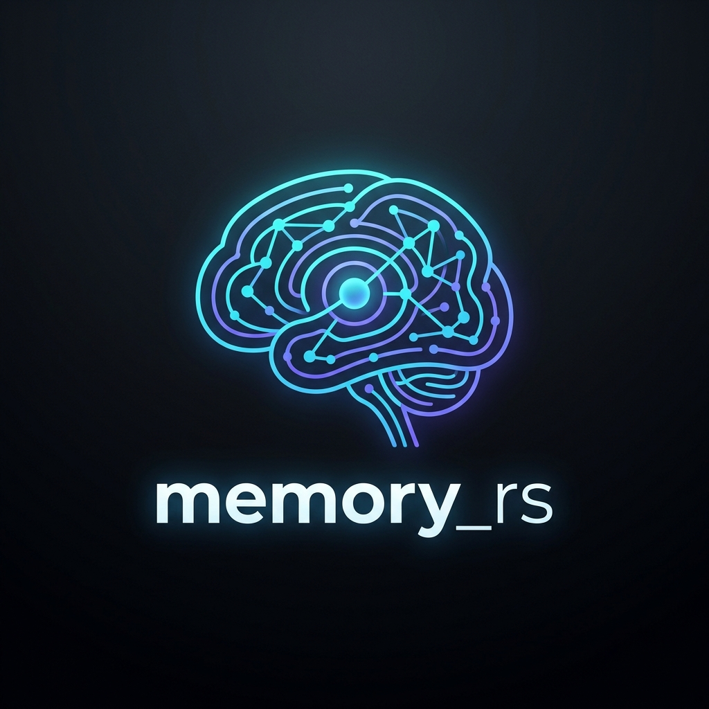
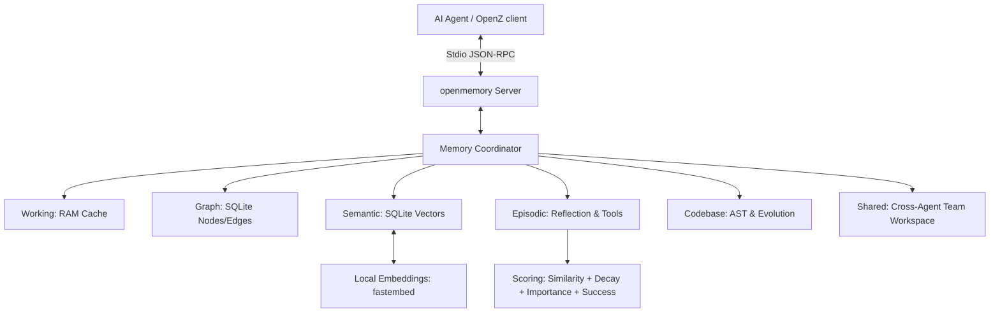

# openmemory_rs

<p align="center">
  
</p>

`openmemory_rs` is a high-performance, unified cognitive memory engine for AI agent frameworks like **OpenZ**, implemented natively in Rust. It combines structured knowledge graphs, local vector embeddings, AST codebase analysis, episodic task reflections, and synchronized team workspaces into a single, high-performance local server.

---

## 📖 Documentation Index
For deep-dive specification sheets and code module mappings, view the documents in the `docs/` folder:
* 🖥️ **Interactive Diagram**: [docs/architecture.html](docs/architecture.html) (Interactive standalone SVG/CSS card)
* 🧠 **System Architecture**: [docs/architecture.md](docs/architecture.md) (6 Cognitive Layers & 9 SQLite tables spec)
* ⚡ **Engine Features**: [docs/features.md](docs/features.md) (Ranking equations, decay formulas, codebase analysis details)
* 📁 **Codebase Structure**: [docs/codebase.md](docs/codebase.md) (Source code modules, dependencies, compile guide)

---

## 🚀 Key Features

* **6 Cognitive Memory Layers**: Integrated session RAM (Working Memory), relations (Graph Memory), local vectors (Semantic Memory), task execution feedback loops (Episodic Memory), static codebase trees (Codebase Memory), and shared agent workspaces (Shared Memory).
* **43 MCP Tools**: Comprehensive tool coverage across all cognitive layers — knowledge graph CRUD, episodic learning, hybrid search, working memory with TTL, smart store with deduplication, conflict resolution, temporal queries, graph intelligence, context compression, and more.
* **AST Codebase & Dependency Graphs**: Static AST symbol parsing for Rust, Python, Go, and JS/TS. Evaluates structs, functions, parent scopes, and caller hierarchies locally.
* **Episodic Learning & Reflection**: Tracks task status (Success/Failure), attempt traces, error root-causes, and reflections to guide future attempts.
* **Tool & Model Performance Metrics**: Monitors tool/model usage counts, latencies, and success ratios to help agents choose optimal models dynamically.
* **Multi-Agent Shared workspace**: Syncs variables and shared facts across multiple parallel subagent instances.
* **Bi-temporal Fact Model**: Full temporal awareness with fact invalidation, history queries, and as-of time-travel queries.
* **Conflict Resolution Engine**: Detects and resolves contradicting facts in graph and semantic layers using configurable strategies (recency, confidence).
* **Smart Store & Deduplication**: Intelligent memory ingestion with automatic duplicate detection, importance scoring, and memory compaction.
* **Context Intelligence**: Algorithmic fact extraction from natural text, proactive cross-layer recall, and TF-IDF context compression.
* **Graph Intelligence**: Multi-hop BFS traversal, shortest path finding, community detection, and code impact analysis.
* **Temporal Recency Decay**: Implements mathematical decay ($e^{-\lambda t}$) prioritizing fresh or manually marked important context.
* **100% Offline Vector Search**: Runs embeddings locally on CPU using ONNX Runtime (`all-MiniLM-L6-v2`) with zero external API calls.
* **Local Persistence**: Saves all structural layers in a unified transaction-safe SQLite database (`memory.db`).
* **Database Branching**: Create sandboxed database branches for experimental changes, then commit or rollback atomically.
* **Input Validation & Security**: All 43 tool handlers enforce identifier validation, text length limits, and SQL injection protection.

---

## ⚡ Performance & Resource Profile

`openmemory_rs` is engineered for minimal resource consumption and maximum throughput. It runs efficiently on everything from Raspberry Pis to beefy development workstations.

### System Requirements

| Resource | Minimum | Recommended | Notes |
|:---------|:--------|:------------|:------|
| **CPU** | 1 core (x86_64/ARM64) | 2+ cores | ONNX embedding model runs on CPU; more cores = faster batch indexing |
| **RAM** | ~10 MB idle | 32–64 MB under load | In-memory HNSW index grows with corpus size; SQLite uses mmap |
| **Storage** | ~32 MB (binary) | 50+ MB | Binary (32 MB) + `memory.db` grows with stored memories |
| **OS** | Linux (glibc 2.31+) | Linux / macOS | Native Rust — no VM, no interpreter, no container runtime required |

### Performance Characteristics

| Operation | Latency | Notes |
|:----------|:--------|:------|
| **Server startup** | **< 1 ms** | Instant — no JIT warmup, no module loading |
| **Entity creation** | **< 0.5 ms** | Direct SQLite insert with WAL mode |
| **Vector embedding** | **~5–15 ms** | Local `all-MiniLM-L6-v2` via ONNX Runtime (384-dim) |
| **Hybrid search (RRF)** | **~10–25 ms** | Reciprocal Rank Fusion of HNSW vector + FTS5 keyword |
| **Graph BFS traversal** | **< 1 ms** | Custom VecDeque BFS with depth bounding |
| **Fact extraction** | **< 2 ms** | Regex-based triple extraction, no LLM calls |
| **Context compression** | **< 5 ms** | TF-IDF sentence scoring with Porter stemming |
| **Database branch commit** | **~2–5 ms** | Atomic file copy + connection switch |

### Why So Fast?

1. **Pure Rust** — Zero-cost abstractions, no garbage collector, no runtime overhead.
2. **SQLite WAL Mode** — Concurrent readers never block writers. `PRAGMA synchronous=NORMAL` for throughput.
3. **Local ONNX Embeddings** — `fastembed` runs `all-MiniLM-L6-v2` directly on CPU via ONNX Runtime. No API calls, no network latency, no token costs.
4. **In-process HNSW Index** — `small-world-rs` provides an in-memory approximate nearest neighbor index rebuilt on mutations, giving sub-millisecond vector similarity lookups.
5. **FTS5 Full-Text Search** — SQLite's native full-text search extension provides instant keyword matching without external search infrastructure.
6. **Zero Dependencies on External Services** — No Redis, no Elasticsearch, no cloud vector stores. Everything runs in a single process with a single file.

---

## ⚖️ Comparative Overview

`openmemory_rs` merges features from three reference architectures into a single, high-performance native engine:

| Attribute | Memory MCP (TypeScript Reference) | Supermemory MCP | Codebase-Memory MCP | `openmemory_rs` (Rust Engine) |
| :--- | :--- | :--- | :--- | :--- |
| **Language** | TypeScript / Node.js | TypeScript / Deno | Go / C | **Pure Rust** |
| **Persistence** | Flat JSON (Full file parse) | Remote cloud vector store | Local SQLite | **Local SQLite (`memory.db`)** |
| **AST Parse** | ❌ None | ❌ None | ✅ Tree-sitter | **✅ Native Codebase Parser** |
| **Vectors/Embed** | ❌ None | ✅ Cloud Embeddings | ❌ None | **✅ Local ONNX (`all-MiniLM-L6`)** |
| **Episodic Reflection**| ❌ None | ❌ None | ❌ None | **✅ Log attempts, root-causes** |
| **Team Share** | ❌ None | ❌ None | ❌ None | **✅ Cross-agent team boards** |
| **Tool Performance** | ❌ None | ❌ None | ❌ None | **✅ Tracks model & tool latencies** |
| **Conflict Resolution** | ❌ None | ❌ None | ❌ None | **✅ Graph & semantic conflict engine** |
| **Temporal Queries** | ❌ None | ❌ None | ❌ None | **✅ Bi-temporal time-travel** |
| **Context Intelligence** | ❌ None | ❌ None | ❌ None | **✅ Fact extraction, proactive recall** |
| **Graph Intelligence** | ❌ None | ❌ None | ❌ None | **✅ BFS, pathfinding, communities** |
| **MCP Tools** | 8 | 5 | 6 | **43** |
| **Startup / RAM** | Slow / ~80MB RAM | Slow / Cloud dependent | Fast / ~30MB RAM | **Sub-ms / <10MB RAM** |

---

## 🛠️ System Architecture

The core coordinator routes incoming JSON-RPC calls over Stdio streams or Tonic gRPC transport to the corresponding memory layer, updating SQLite tables and calculating vector cosine similarity scores on demand.


```mermaid
graph TD
    Client[AI Agent / OpenZ client] <-->|Stdio JSON-RPC| Server[openmemory Server]
    Server <--> Coordinator[Memory Coordinator]
    
    Coordinator --> L1[Working: RAM Cache]
    Coordinator --> L2[Graph: SQLite Nodes/Edges]
    Coordinator --> L3[Semantic: SQLite Vectors]
    Coordinator --> L4[Episodic: Reflection & Tools]
    Coordinator --> L5[Codebase: AST & Evolution]
    Coordinator --> L6[Shared: Cross-Agent Team Workspace]
    
    L3 <--> LocalEmbedding[Local Embeddings: fastembed]
    L4 --> Ranker[Scoring: Similarity + Decay + Importance + Success]
```

---

## ⚙️ Quickstart

### 1. Compile the Release Crate
Ensure you have the Rust compiler and Cargo toolchain installed:
```bash
cargo build --release
```
The compiled native executable will be written to:
`target/release/openmemory_rs`

Install it to your local user binary directory for stable execution:
```bash
mkdir -p ~/.local/bin
cp target/release/openmemory_rs ~/.local/bin/openmemory_rs
```

### 2. Configure with your MCP Client (e.g. Claude Desktop)
Add the configuration into your client's config file (e.g., `~/.config/Claude/claude_desktop_config.json`):

```json
{
  "mcpServers": {
    "openmemory": {
      "command": "/home/user/.local/bin/openmemory_rs",
      "args": ["--db-path", "/home/user/.local/share/openmemory/memory.db"]
    }
  }
}
```

---

## 📡 gRPC Transport

`openmemory_rs` natively supports serving over gRPC in addition to stdio. Launch the server with `--grpc <port>` to bind it as a gRPC service:
```bash
./target/release/openmemory_rs --grpc 50051
```
This isolates the communication channel, making it completely resilient to standard stream pollution (like random logs or printing to `stdout` from libraries).

---

## 🔌 Exposed MCP Tools (43 Tools)

`openmemory_rs` registers **43 comprehensive tools** categorized by cognitive layers:

### 1. Knowledge Graph Tools (9 tools)
* `create_entities`: Create nodes with entity types and observations.
* `create_relations`: Link entities with active-voice connections.
* `add_observations`: Append observations to existing nodes.
* `delete_entities` / `delete_observations` / `delete_relations`: Delete nodes/edges.
* `read_graph`: Retrieve the full entity-relationship graph.
* `search_nodes`: Filter nodes matching keyword pattern matching.
* `open_nodes`: Retrieve observation records of nodes by name.

### 2. Code Intelligence Tools (4 tools)
* `index_codebase`: Index files under a path into codebase AST elements and calls.
* `query_code_graph`: Find indexed functions, structs, parent blocks, and signatures.
* `log_repository_evolution`: Track file changes, commits, versions, and bug status metrics.
* `query_repository_evolution`: Retrieve codebase revision summaries.

### 3. Episodic Learning & Performance Tools (5 tools)
* `log_execution_episode`: Record runtime step-by-step logs, status, and summaries.
* `log_reflection`: Store attempts, failures, root causes, and solution logs.
* `retrieve_episodic_reflections`: Query historical reflecting cards to guide current runs.
* `record_tool_performance`: Track success counts and latencies for LLMs/tools.
* `query_tool_performance`: Recommend models or tools based on metrics history.

### 4. Semantic Search Tools (2 tools)
* `search_text`: Full-text keyword search via SQLite FTS5.
* `hybrid_search`: Combined vector + FTS5 search with Reciprocal Rank Fusion (RRF).

### 5. Shared Team Memory Tools (2 tools)
* `store_shared_team_memory`: Store key-value data shared across target agent IDs.
* `retrieve_shared_team_memory`: Retrieve target messages/contexts for specific agent IDs.

### 6. Working Memory Tools (4 tools)
* `set_working_memory` / `get_working_memory`: Read/write RAM-cached short-term memories with TTL.
* `evict_expired_working_memory`: Clear short-term memory keys based on TTL.
* `promote_working_memory`: Graduate working memory to permanent semantic storage.

### 7. Smart Store & Consolidation Tools (2 tools)
* `smart_store`: Intelligent memory ingestion with automatic deduplication and importance scoring.
* `compact_memories`: Compact similar memories and apply recency decay algorithms.

### 8. Conflict Resolution Tools (1 tool)
* `detect_and_resolve_conflicts`: Detect and resolve contradicting facts in graph and semantic layers with configurable strategies.

### 9. Temporal Query Tools (3 tools)
* `invalidate_fact`: Apply soft invalidation to facts or relations.
* `query_fact_history`: Retrieve the bi-temporal state history of a fact.
* `query_as_of`: Query the active memory graph state as of a historical ISO 8601 timestamp.

### 10. Graph Intelligence Tools (4 tools)
* `traverse_graph`: Traverse nodes and edges from a start entity using BFS up to a maximum depth.
* `find_path`: Find the shortest path and relations between two entity nodes.
* `analyze_graph_communities`: Segment the graph into weakly connected components and summarize themes.
* `analyze_code_impact`: Calculate downstream callers and change risk for a codebase symbol recursively.

### 11. Context Intelligence Tools (3 tools)
* `extract_and_store_facts`: Parse entity-relation triples from natural language text and store in the knowledge graph.
* `proactive_recall`: Cross-layer context retrieval combining semantic, graph, and episodic results.
* `compress_context`: TF-IDF sentence scoring with token budget to compress large context windows.

### 12. Database Branching Tools (3 tools)
* `create_database_branch`: Create a sandboxed database branch.
* `commit_database_branch` / `rollback_database_branch`: Merge or discard sandboxed changes.

### 13. System Tools (1 tool)
* `memory_stats`: Get memory access statistics, table row counts, and database size metrics.

---

## 🧪 Testing & Verification

`openmemory_rs` has a comprehensive multi-layer test strategy ensuring production reliability:

### Test Suite Overview

| Test Layer | Count | Description |
|:-----------|:------|:------------|
| **Unit Tests** | 33 | Tests per module — graph, semantic, episodic, conflict, importance, community |
| **gRPC Integration** | 1 | Full round-trip through Tonic gRPC transport |
| **E2E MCP Integration** | 40 | Real JSON-RPC requests over stdio to the release binary |
| **Criterion Benchmarks** | 4 | Micro-benchmarks for semantic, search, compression, and BFS |
| **Total** | **78** | |

### Running Unit & Integration Tests
```bash
cargo test
```

### Running E2E Integration Tests
The E2E suite launches the compiled release binary, sends real JSON-RPC requests over stdio, and validates responses across all 15 test categories:

```
▶ Protocol Handshake          ✓ MCP initialize
▶ Knowledge Graph CRUD        ✓ create/read/update/delete entities, relations, observations
▶ Episodic Memory             ✓ episodes, reflections, retrieval
▶ Search (FTS5 + Hybrid RRF)  ✓ full-text and vector+FTS5 hybrid search
▶ Working Memory (TTL)        ✓ set, get, promote, evict with TTL
▶ Smart Store & Consolidation ✓ dedup, importance scoring, compaction
▶ Tool Performance            ✓ record and query tool stats
▶ Shared Team Memory          ✓ cross-agent store and retrieve
▶ System Stats                ✓ memory_stats
▶ Temporal Queries            ✓ invalidate, history, as-of time travel
▶ Conflict Resolution         ✓ recency strategy engine
▶ Graph Intelligence          ✓ BFS traversal, pathfinding, communities
▶ Context Intelligence        ✓ fact extraction, proactive recall, compression
▶ Database Branching          ✓ create and commit branches
▶ Security Validation         ✓ oversized input rejection, SQL injection, invalid identifiers
```

### Running Benchmarks
To run the Criterion performance micro-benchmarks profiling semantic database insertions, hybrid search queries, context compression, and graph BFS traversals:
```bash
cargo bench
```

---

## 🎯 Use Cases

### For AI Agent Developers
* **Persistent agent memory** — Give your AI agents long-term memory that survives session boundaries. Store facts, learn from past mistakes, and build knowledge over time.
* **Multi-agent collaboration** — Share context between parallel agent instances via the shared team memory layer.
* **Code-aware AI** — Index your codebase and let agents understand function signatures, call hierarchies, and dependency chains.

### For MCP Server Operators
* **Drop-in MCP memory backend** — Replace flat-file JSON memory with a proper cognitive engine. One binary, one SQLite file, 43 tools.
* **Zero infrastructure** — No Redis, no Elasticsearch, no cloud vector stores. Everything runs locally in a single process.
* **gRPC or Stdio** — Choose your transport: standard MCP stdio for simple setups, or gRPC for production deployments.

### For Research & Experimentation
* **Temporal reasoning** — Query how an agent's knowledge evolved over time with bi-temporal fact history and as-of queries.
* **Conflict detection** — Study how contradicting facts emerge and get resolved across graph and semantic layers.
* **Database branching** — Experiment with memory mutations in sandboxed branches without risking production state.

### Real-World Scenarios

| Scenario | Tools Used |
|:---------|:-----------|
| **Coding assistant remembers past bugs** | `log_reflection`, `retrieve_episodic_reflections`, `proactive_recall` |
| **Agent builds knowledge graph from docs** | `extract_and_store_facts`, `create_entities`, `create_relations` |
| **Multi-agent team shares deployment notes** | `store_shared_team_memory`, `retrieve_shared_team_memory` |
| **Time-travel to last week's knowledge** | `query_as_of`, `query_fact_history` |
| **Find all code impacted by a function change** | `index_codebase`, `analyze_code_impact`, `traverse_graph` |
| **Compress 10K tokens of context to 2K** | `compress_context` with `ratio: 0.2` |
| **Agent picks the fastest model for a task** | `record_tool_performance`, `query_tool_performance` |
| **Resolve conflicting facts after merge** | `detect_and_resolve_conflicts` with `strategy: "recency"` |

---

## 📊 Project Stats

| Metric | Value |
|:-------|:------|
| **Language** | Pure Rust (Edition 2024) |
| **Source Lines** | ~8,500 LOC |
| **Binary Size** | ~32 MB (release, statically linked ONNX) |
| **MCP Tools** | 43 |
| **Test Coverage** | 34 unit/integration + 40 E2E + 4 benchmarks |
| **SQLite Tables** | 9 (graph, semantic, episodic, codebase, shared, working, FTS5, HNSW, access log) |
| **Embedding Model** | `all-MiniLM-L6-v2` (384-dim, ONNX, local CPU) |
| **Transport** | Stdio JSON-RPC + Tonic gRPC |
| **License** | MIT |
