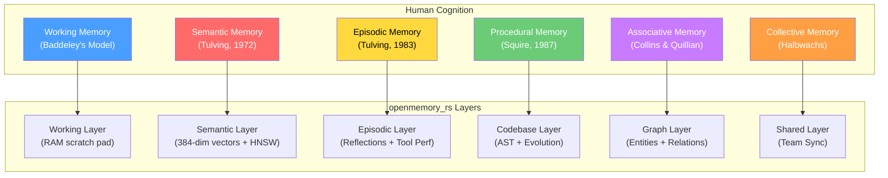
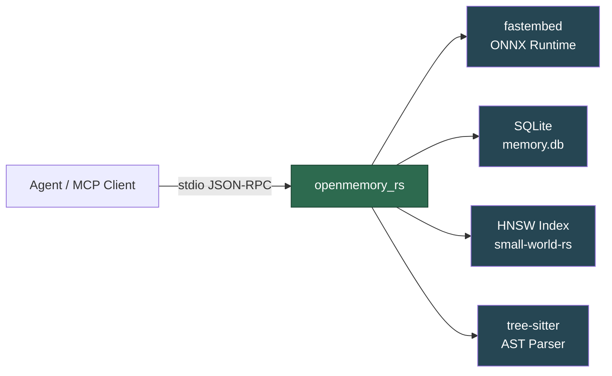
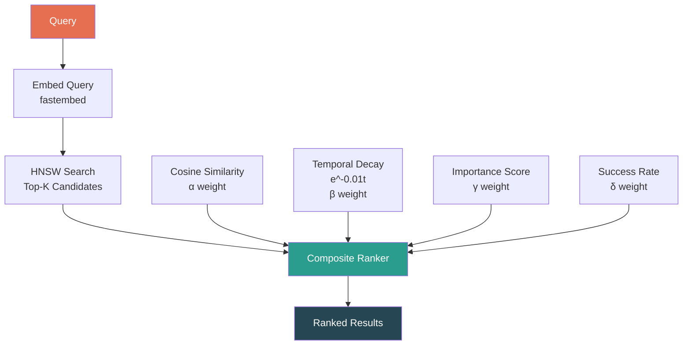
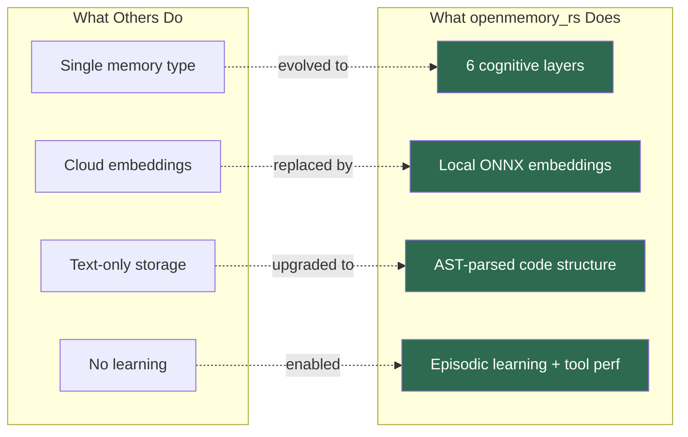
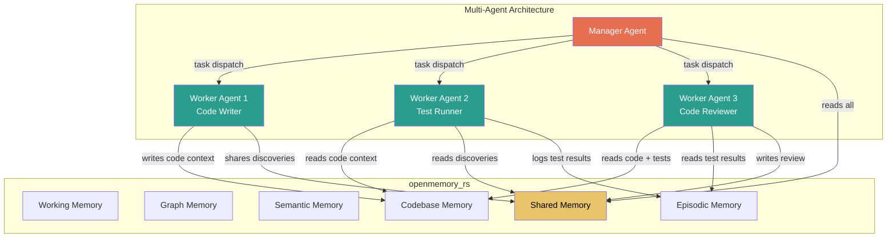
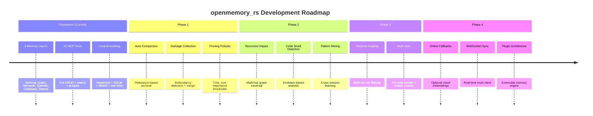

# openmemory_rs — Core Idea

> **A unified, multi-tiered cognitive memory engine for AI agent frameworks, written in pure Rust.**

---

## Table of Contents

- [1. The Problem Statement](#1-the-problem-statement)
- [2. The Core Thesis](#2-the-core-thesis)
- [3. The 6 Cognitive Memory Layers](#3-the-6-cognitive-memory-layers)
- [4. Key Design Principles](#4-key-design-principles)
- [5. Competitive Landscape](#5-competitive-landscape)
- [6. Target Users & Use Cases](#6-target-users--use-cases)
- [7. Vision & Future Roadmap](#7-vision--future-roadmap)

---

## 1. The Problem Statement

### Why Do AI Agents Need Persistent, Structured Memory?

Large Language Models are stateless by design. Every conversation starts from zero. Every tool invocation forgets the last. Every agent loop rebuilds context from scratch. This fundamental architectural gap — **the absence of persistent, structured memory** — is the single largest bottleneck preventing AI agents from achieving true autonomy.

Consider what happens when a human developer works on a codebase. They remember which files they touched yesterday. They recall that a particular refactor broke tests last week. They know that `UserService` depends on `AuthProvider` because they wired it themselves. They build up a **cognitive map** — a layered, associative, temporally-aware model of the project — over days, weeks, and months.

AI agents have none of this. They are perpetual amnesiacs.

### The 7 Pain Points of Memoryless Agents

#### Pain Point 1: Context Window Exhaustion

Modern LLMs have finite context windows (128K–2M tokens). A medium-sized codebase (50K lines) already exceeds most context limits when fully loaded. Agents must selectively retrieve relevant context, but **without memory of what was relevant before**, they resort to brute-force file loading — stuffing the context window with everything and hoping the model figures it out.

**Real example:** An autonomous coding agent is asked to "fix the authentication bug." Without memory, it must re-scan the entire codebase to find authentication-related files, re-discover the dependency graph, and re-understand the control flow — work it may have done 5 minutes ago in a previous tool call.

#### Pain Point 2: Repeated Mistakes

Agents make mistakes. They try approaches that fail, hit edge cases, trigger test failures. But without episodic memory, **they cannot learn from these failures**. The next time they encounter a similar problem, they repeat the same failed approach, wasting tokens, time, and user trust.

**Real example:** An agent tries to use `unwrap()` on a `Result` type in Rust and causes a panic. Without memory, the next time it encounters a similar pattern, it reaches for `unwrap()` again. A human developer would remember: "Last time I used `unwrap()` here, it panicked on the `None` case. I should use `match` or `unwrap_or_default()` instead."

#### Pain Point 3: Lost Relational Context

Codebases are graphs — functions call functions, modules depend on modules, types implement traits. Flat file retrieval (the status quo for most agent tools) destroys this relational structure. Agents cannot answer questions like "What depends on this function?" or "If I change this struct, what breaks?" without re-parsing the entire project.

**Real example:** An agent modifies a `User` struct by removing the `email` field. Without a dependency graph in memory, it doesn't know that `send_notification()`, `validate_registration()`, and three API handlers all reference `user.email`. The change compiles in the modified file but breaks five others.

#### Pain Point 4: No Temporal Awareness

Human developers have an intuitive sense of recency: "I just changed that file," "that test started failing after the last refactor," "we deprecated that API last month." Existing agent memory systems (when they exist at all) treat all information as equally current. There is no concept of **temporal decay** — the understanding that recent information is typically more relevant than stale information.

**Real example:** An agent retrieves a code snippet from memory that was stored 3 weeks ago. Since then, the API it references has been completely rewritten. The agent generates code using the old API, producing compilation errors. A temporal decay mechanism would have down-ranked or flagged the stale information.

#### Pain Point 5: Cloud Dependency & Privacy Leakage

Most existing memory solutions (Mem0, Pinecone-backed stores, cloud vector databases) require sending data to external servers. For enterprise codebases, proprietary algorithms, or sensitive personal projects, this is a non-starter. The choice between "memory" and "privacy" should not exist.

**Real example:** A developer working on a proprietary trading algorithm cannot use cloud-based memory solutions without risking exposure of their strategies. They are forced to choose between the productivity gains of agent memory and the confidentiality requirements of their work.

#### Pain Point 6: Single-Layer Flat Storage

Existing memory solutions typically offer a single storage paradigm: either key-value pairs, flat vector embeddings, or unstructured text blobs. Human cognition doesn't work this way. We have distinct memory systems — working memory for immediate context, semantic memory for concepts and relationships, episodic memory for experiences, procedural memory for learned skills. **Cramming all memory types into a single flat store destroys the structural richness that makes memory useful.**

**Real example:** An agent stores "the user prefers tabs over spaces" in the same flat vector store as "function `parse_config` was refactored on June 15" and "the last three attempts to fix issue #42 all failed due to a race condition." These are fundamentally different types of information (preference, event, episodic learning) that should be stored, indexed, and retrieved differently.

#### Pain Point 7: No Multi-Agent Coordination

Modern AI workflows increasingly involve multiple agents working in parallel — one agent writes code, another reviews it, a third runs tests. Without shared memory, these agents operate in isolation, duplicating work, making conflicting changes, and unable to build on each other's discoveries.

**Real example:** Agent A discovers that a particular test is flaky and always passes on retry. Agent B, working in parallel, encounters the same flaky test and wastes 10 minutes debugging it. If Agent A had written its discovery to shared memory, Agent B would have known immediately.

---

## 2. The Core Thesis

### Cognitive Memory for Machines

openmemory_rs is built on a single thesis:

> **AI agents should have a memory architecture that mirrors human cognition — not a flat database, but a multi-tiered, associative, temporally-aware cognitive engine.**

Human memory is not a single system. Decades of cognitive science research (Atkinson & Shiffrin, Tulving, Baddeley) have established that human memory comprises multiple interacting subsystems, each specialized for different types of information and different retrieval patterns.

openmemory_rs maps these cognitive subsystems directly onto computational structures:



### The Cognitive Analogies in Depth

#### Working Memory → Working Layer

In Baddeley's model of working memory (1974, revised 2000), the central executive maintains a small, rapidly-accessible buffer of information currently being processed. It has severely limited capacity (roughly 4±1 chunks) but provides instant access. Information in working memory is volatile — it decays unless actively rehearsed or transferred to long-term storage.

openmemory_rs's **Working Layer** mirrors this exactly. It maintains an in-RAM scratch pad of the agent's current operational context: active files, recent tool results, pending decisions, the current task description. It is fast (nanosecond access), small (bounded by design), and ephemeral (cleared between sessions unless explicitly persisted). This layer answers the question: *"What am I currently doing?"*

#### Semantic Memory → Semantic Layer

Tulving's semantic memory (1972) stores general knowledge and concepts — facts, meanings, and relationships that are independent of personal experience. You know that "Rust is a systems programming language" and "HTTP 404 means not found" without remembering when or where you learned these facts.

openmemory_rs's **Semantic Layer** stores vector-embedded representations of concepts, code patterns, documentation snippets, and general knowledge. Using fastembed's `all-MiniLM-L6-v2` model (384 dimensions), it converts textual information into dense vectors and indexes them in an HNSW graph for approximate nearest-neighbor search. This layer answers the question: *"What do I know about X?"*

#### Episodic Memory → Episodic Layer

Tulving's episodic memory (1983) stores autobiographical events — experiences anchored in time and context. You remember *that time* you stayed up until 3am debugging a null pointer exception, *that project* where the CI pipeline kept failing on Fridays, *that conversation* where your colleague explained the Observer pattern.

openmemory_rs's **Episodic Layer** stores reflections, tool performance records, and experiential summaries. When an agent successfully fixes a bug using a particular approach, it records the episode: what was tried, what worked, what failed, and what was learned. This layer answers the question: *"What happened last time I tried X?"*

#### Procedural Memory → Codebase Layer

Procedural memory (Squire, 1987) stores learned skills and procedures — how to ride a bicycle, how to type on a keyboard, how to write a for-loop. It is deeply structural: not just *what* something is, but *how* it works at a mechanical level.

openmemory_rs's **Codebase Layer** uses tree-sitter to parse source code into Abstract Syntax Trees, extracting structural elements (functions, structs, traits, imports) and tracking their evolution over time. It doesn't just know *that* a function exists — it knows *how* it's structured, what it depends on, and how it has changed. This layer answers the question: *"How does this code actually work?"*

#### Associative Memory → Graph Layer

Collins and Quillian's semantic network model (1969) describes how human memory organizes concepts in a web of associations — "dog" is linked to "animal," "pet," "bark," "leash." Retrieval follows these associative links, enabling spreading activation: thinking of "dog" makes "cat" more accessible.

openmemory_rs's **Graph Layer** stores entities (people, projects, concepts, files) and their relationships in a directed graph. It enables queries like "What entities are related to the authentication system?" and supports spreading activation for associative retrieval. This layer answers the question: *"What is connected to X?"*

#### Collective Memory → Shared Layer

Halbwachs' concept of collective memory (1925) describes how groups construct shared memories — the team's knowledge of "how we do things here," organizational norms, shared experiences, and institutional knowledge.

openmemory_rs's **Shared Layer** enables multiple agents (or multiple sessions of the same agent) to read and write to a common memory space. Agent A's discoveries become available to Agent B. Team norms, project conventions, and shared decisions persist across individual agent lifetimes. This layer answers the question: *"What does the team know?"*

---

## 3. The 6 Cognitive Memory Layers

### Layer 1: Working Memory (RAM Scratch Pad)

#### Cognitive Analogy
Mirrors Baddeley's working memory model — a limited-capacity, rapidly-accessible buffer for currently active information. Like the human phonological loop and visuospatial sketchpad, it holds transient operational state.

#### What It Stores
- **Active context**: The current file being edited, the task description, recent tool outputs
- **Scratch notes**: Temporary observations, hypotheses, and intermediate reasoning steps
- **Session state**: Which tools have been called, what decisions are pending, what the agent's current plan is
- **Pinned items**: Information the agent has explicitly marked as important for the current task

#### How It Differs from Existing Solutions
Most agent frameworks have no concept of working memory — they rely entirely on the LLM's context window, which is expensive (token-priced) and fragile (subject to truncation and attention decay). openmemory_rs provides a dedicated, structured, zero-cost RAM buffer that persists across tool calls within a session without consuming context tokens.

#### Real-World Use Cases
1. **Multi-step refactoring**: An agent refactoring a module needs to track which files it has already modified, which still need changes, and what the overall refactoring plan is. Working memory holds this operational state without polluting the LLM context.
2. **Hypothesis tracking during debugging**: While debugging a test failure, the agent generates hypotheses ("maybe the timeout is too short," "maybe the mock is stale"). Working memory lets it track which hypotheses have been tested and eliminated.
3. **Tool chain coordination**: An agent running a sequence of tools (search → read → edit → test) uses working memory to carry forward the results of each step without re-querying.
4. **Context overflow prevention**: When the LLM context is approaching its limit, the agent can offload lower-priority information to working memory, keeping only the most critical context in the prompt.

---

### Layer 2: Graph Memory (Entities & Relations)

#### Cognitive Analogy
Mirrors Collins & Quillian's semantic network — a web of interconnected nodes (entities) and edges (relations) that enables associative retrieval and spreading activation. Like the human ability to follow chains of association: "authentication → JWT → token expiry → refresh flow."

#### What It Stores
- **Entities**: Named concepts with types (person, project, module, concept, decision, file)
- **Relations**: Typed, directed edges between entities (depends_on, authored_by, implements, supersedes, related_to)
- **Relation metadata**: Confidence scores, timestamps, source references
- **Entity attributes**: Descriptions, tags, importance scores

#### How It Differs from Existing Solutions
Most memory solutions store information as isolated vectors or key-value pairs with no relational structure. Graph memory enables **structural queries** ("What depends on the auth module?"), **path traversal** ("How is the payment system connected to the user service?"), and **impact analysis** ("If I change X, what else is affected?"). No existing MCP memory server offers entity-relation graph storage.

#### Real-World Use Cases
1. **Dependency impact analysis**: Before modifying a core function, the agent queries the graph to discover all downstream dependents — preventing the cascading breakage described in Pain Point 3.
2. **Knowledge graph construction**: As the agent reads documentation and code, it automatically extracts entities and relations, building an ever-richer knowledge graph of the project that persists across sessions.
3. **Onboarding acceleration**: A new agent (or a new session) can query the graph to rapidly understand the project's architecture: "Show me all modules and their dependencies" returns a structural map without re-reading every file.
4. **Decision tracking**: Architectural decisions ("We chose PostgreSQL over MongoDB because...") are stored as entities with relations to the components they affect, enabling future agents to understand *why* things are the way they are.

---

### Layer 3: Semantic Memory (Vector Embeddings)

#### Cognitive Analogy
Mirrors Tulving's semantic memory — the store of general knowledge, concepts, and meanings. Like knowing what "dependency injection" means without remembering when you first learned about it.

#### What It Stores
- **Embedded text chunks**: Code snippets, documentation passages, commit messages, issue descriptions — all converted to 384-dimensional vectors via fastembed's `all-MiniLM-L6-v2` model
- **HNSW index**: An in-memory Hierarchical Navigable Small World graph (via `small-world-rs`) for sub-millisecond approximate nearest-neighbor search
- **Metadata**: Source file, line range, timestamp, memory layer origin, tags
- **Importance scores**: Agent-assigned or algorithmically computed importance weights

#### How It Differs from Existing Solutions
Unlike cloud vector stores (Pinecone, Weaviate, ChromaDB server), openmemory_rs runs embeddings **100% locally** using ONNX Runtime — no API calls, no network latency, no data leaving the machine. Unlike simple vector stores, it combines semantic similarity with **multi-factor composite ranking** (see Section 4) that accounts for recency, importance, and tool success rate alongside cosine similarity.

#### Real-World Use Cases
1. **Fuzzy code search**: The agent asks "How do we handle authentication?" and gets semantically similar results even if the code uses terms like "auth," "login," "credentials," or "session management" — none of which are exact keyword matches.
2. **Pattern recognition across sessions**: Over multiple sessions, the semantic layer accumulates embedded representations of successful solutions. When a new problem arises, the agent can find similar past solutions via vector similarity.
3. **Documentation retrieval**: Technical documentation, README content, and inline comments are embedded and searchable, giving the agent access to project knowledge without re-reading files.
4. **Cross-language concept matching**: Because embeddings capture meaning rather than syntax, a concept documented in English can be matched against code written in any supported language.

---

### Layer 4: Episodic Memory (Reflections & Tool Performance)

#### Cognitive Analogy
Mirrors Tulving's episodic memory — the autobiographical record of personal experiences, anchored in time and context. Like remembering "the time I debugged that race condition by adding a mutex" — not just the fact, but the experience.

#### What It Stores
- **Reflections**: Agent-generated summaries of what happened, what worked, what didn't, and what was learned during a task or session
- **Tool performance records**: For every tool invocation — which tool, what arguments, whether it succeeded, how long it took, what the agent learned from the result
- **Episode metadata**: Timestamps, task context, agent ID, session ID, outcome classification (success/failure/partial)
- **Causal chains**: Links between episodes ("I tried approach A, which failed because X, so I tried approach B, which succeeded because Y")

#### How It Differs from Existing Solutions
No existing MCP memory server tracks **tool performance** or **agent reflections**. LangChain's memory stores conversation history (a log, not a learning). Mem0 stores preferences and facts. openmemory_rs's episodic layer captures **experiential learning** — the agent's equivalent of "wisdom gained from experience."

#### Real-World Use Cases
1. **Learning from failures**: An agent that failed to fix a bug using approach A can, in future sessions, retrieve the episode and avoid repeating the same mistake. The reflection might say: "Replacing `unwrap()` with `expect()` does not fix the panic — the root cause was a missing `None` check in the upstream function."
2. **Tool selection optimization**: By tracking tool performance (success rate, latency, usefulness), the agent can learn which tools are most effective for which tasks. If `grep_search` consistently returns better results than `semantic_search` for exact identifier lookup, the agent learns this preference.
3. **Progress journaling**: Long-running tasks (multi-day refactors, feature implementations) can be resumed with full context by reading episodic summaries: "Yesterday I completed steps 1-3, encountered a blocker on step 4 due to missing type definitions, and planned to resolve it by..."
4. **Confidence calibration**: By reviewing past episodes where the agent was confident but wrong, it can calibrate its confidence levels — becoming more cautious in domains where it has a history of errors.

---

### Layer 5: Codebase Memory (AST & Evolution)

#### Cognitive Analogy
Mirrors procedural memory — the deeply structural knowledge of *how* things work. Like a mechanic's understanding of an engine: not just "it makes the car go" but the specific arrangement of pistons, valves, and timing chains.

#### What It Stores
- **AST-parsed symbols**: Functions, structs, enums, traits, classes, methods — extracted via tree-sitter for Rust, Python, JavaScript, TypeScript, and TSX, with a fallback line-based parser for unsupported languages
- **Symbol metadata**: File path, line range, visibility (pub/private), signature, docstring, complexity metrics
- **Evolution history**: How symbols have changed over time — additions, modifications, deletions, renames
- **Dependency edges**: Which symbols reference which other symbols (call graph, import graph, type usage)
- **File-level summaries**: Auto-generated descriptions of what each file does and what it exports

#### How It Differs from Existing Solutions
Existing solutions treat code as text — embedding raw source code as strings. openmemory_rs treats code as **structure**. Tree-sitter parsing extracts the AST, enabling queries like "Find all public functions in this module that return a `Result` type" or "Show me every call site of `process_payment()`." No other MCP memory server offers AST-level structural understanding with evolution tracking.

#### Real-World Use Cases
1. **Structural code search**: Instead of text-matching on function names, the agent queries for structural patterns: "Find all async functions that take a `&self` receiver and return `Result<(), Error>`."
2. **Change impact analysis**: When a function signature changes, the codebase layer can instantly identify every call site that needs updating — without re-parsing the entire project.
3. **Evolution-aware refactoring**: The agent can see how a function has evolved: "This function was originally 10 lines, grew to 50 lines over 3 sessions, and had 2 bug fixes. It's a candidate for decomposition."
4. **Cross-file navigation**: The dependency edges enable the agent to navigate from a function to its callers, from a type to its implementations, from an import to its definition — all from memory, without re-reading files.

---

### Layer 6: Shared Memory (Team Sync)

#### Cognitive Analogy
Mirrors Halbwachs' collective memory — the shared knowledge of a group. Like a team's institutional knowledge: "We always run linting before committing," "The staging environment has different credentials than production," "Module X is owned by Team Y."

#### What It Stores
- **Shared facts**: Team conventions, project norms, agreed-upon patterns, configuration details
- **Cross-agent discoveries**: Findings from one agent that are useful to others (e.g., "The API endpoint was rate-limited at 100 req/min")
- **Synchronization metadata**: Agent IDs, write timestamps, conflict resolution records
- **Team decisions**: Architectural Decision Records (ADRs), design choices, and their rationale

#### How It Differs from Existing Solutions
Most memory solutions are single-agent. Even those that support persistence (SQLite-backed stores) don't provide mechanisms for **multi-agent read/write synchronization**. openmemory_rs's shared layer enables multiple agents to build on each other's work, avoid duplicating effort, and maintain consistency across parallel workstreams.

#### Real-World Use Cases
1. **Multi-agent code review**: Agent A writes code, Agent B reviews it, Agent C runs tests. Shared memory lets B access A's design rationale and C access both A's code and B's review comments — all without re-querying the files.
2. **Convention enforcement**: Team coding conventions ("Use `thiserror` for error types," "All public APIs must have doc comments") are stored in shared memory, enabling any agent to enforce them consistently.
3. **Discovery sharing**: Agent A discovers that a particular test is flaky and documents it in shared memory. Agent B, encountering the same test, reads the shared note and skips the debugging phase.
4. **Handoff between sessions**: When one agent session ends and another begins, shared memory provides continuity — the new session can read everything the previous one learned.

---

## 4. Key Design Principles

### The 8 Architectural Philosophies

#### Principle 1: 100% Offline-First (No API Dependencies)

openmemory_rs has **zero external API dependencies** at runtime. Embeddings are computed locally using fastembed with the ONNX Runtime. Vector indexing uses the in-process HNSW implementation from `small-world-rs`. Storage uses a local SQLite database. The MCP transport is stdio-based JSON-RPC.

**Why this matters:** Network dependencies introduce latency (50-500ms per API call), create single points of failure (API downtime kills your agent), impose usage costs (embedding API pricing), and leak data (every query sent to a remote server). openmemory_rs eliminates all four concerns by running everything locally.



No arrows leave the machine. No data leaves the machine. Everything is local.

#### Principle 2: Local-First Privacy

Every byte of data — embeddings, memories, reflections, code analysis — stays on the user's machine. There is no telemetry, no analytics, no "anonymous usage data." The SQLite database file (`memory.db`) is the single source of truth, and the user owns it completely.

**Privacy guarantees:**
- No network calls during operation (verified by architecture — no HTTP client in dependencies)
- No data exfiltration paths (no logging to external services)
- Database file is user-readable (standard SQLite, inspectable with any SQLite client)
- User can delete all memory with a single file deletion (`rm memory.db`)

#### Principle 3: Sub-Millisecond Boot Time

openmemory_rs is a compiled Rust binary. It starts in under 1 millisecond. There is no interpreter startup, no JVM warm-up, no Node.js module resolution, no Python import chain. The MCP server is ready to handle its first request within microseconds of being launched.

**Why this matters:** MCP clients (Claude Desktop, Cursor, Antigravity) launch tool servers on-demand. A slow-starting server introduces perceptible latency on the first tool call. Node.js-based MCP servers typically take 200-800ms to start (module resolution + V8 compilation). Python-based servers take 500-2000ms (import chains + dependency initialization). openmemory_rs starts in <1ms.

#### Principle 4: Unified SQLite Persistence

All 6 memory layers persist to a single SQLite database (`memory.db`) with 12+ tables. This is not a compromise — it's a deliberate architectural choice.

**Why SQLite over separate stores:**
- **Atomicity**: Cross-layer operations (e.g., storing a memory + its embedding + a graph relation) happen in a single transaction. No distributed consistency problems.
- **Simplicity**: One file to back up, one file to migrate, one file to inspect.
- **Performance**: SQLite handles tens of thousands of reads/writes per second on local storage. For agent memory workloads (dominated by reads with occasional writes), it's more than sufficient.
- **Portability**: The database file can be copied to another machine, shared with a colleague, or version-controlled.

```
memory.db
├── memories           # Core memory entries (all layers)
├── memory_tags        # Tag associations
├── embeddings         # 384-dim float vectors
├── entities           # Graph nodes
├── relations          # Graph edges
├── reflections        # Episodic reflections
├── tool_performance   # Tool invocation tracking
├── code_symbols       # AST-parsed symbols
├── code_evolution     # Symbol change history
├── shared_state       # Multi-agent sync
├── branches           # Database branching metadata
├── branch_changes     # Branched memory deltas
└── ...                # Additional operational tables
```

#### Principle 5: Multi-Factor Relevance Ranking with Temporal Decay

When retrieving memories, openmemory_rs doesn't rely on a single relevance signal. It computes a **composite score** that blends four orthogonal factors:

```
Score = α·Similarity + β·Recency + γ·Importance + δ·SuccessRate
```

Where:
- **Similarity** (α): Cosine similarity between the query embedding and the memory embedding (0.0–1.0)
- **Recency** (β): Temporal decay computed as `e^(−0.01 · elapsed_hours)` — memories from 1 hour ago score ~0.99, from 1 day ago ~0.79, from 1 week ago ~0.19
- **Importance** (γ): Agent-assigned or algorithmically computed importance weight (0.0–1.0)
- **SuccessRate** (δ): For tool-performance memories, the historical success rate of the approach (0.0–1.0)

The coefficients α, β, γ, δ are tunable per-query, allowing the agent to weight factors differently depending on the retrieval context:
- For "what's relevant to my current task?" → high α (similarity), medium β (recency)
- For "what did I just do?" → low α, high β (recency)
- For "what's the most important thing I know about X?" → high α, high γ (importance)
- For "what approach works best for Y?" → medium α, high δ (success rate)



#### Principle 6: Sandboxed Memory Branching for Safe Execution

openmemory_rs supports **database branching** — creating isolated forks of the memory state that can be committed or rolled back. This is the cognitive equivalent of "let me think about this without committing to it."

**How it works:**
1. **Create branch**: Snapshot the current memory state to a named branch
2. **Operate on branch**: All reads/writes are scoped to the branch — the main memory is unaffected
3. **Commit branch**: Merge the branch's changes back into main memory
4. **Rollback branch**: Discard the branch's changes entirely

**Use cases:**
- **Speculative execution**: An agent can explore a risky approach on a branch. If it fails, rollback. If it succeeds, commit.
- **A/B memory testing**: Compare two different memory states to see which produces better agent behavior.
- **Safe experimentation**: Try adding new memories or modifying existing ones without risking corruption of the main state.

#### Principle 7: Multi-Agent State Synchronization

The shared memory layer provides primitives for multiple agents to coordinate through memory:

- **Write with agent ID**: Every shared memory entry is tagged with the writing agent's identifier
- **Read with recency**: Agents can query shared memory filtered by time window ("What was shared in the last hour?")
- **Conflict detection**: When two agents modify the same entity, the system records both versions with timestamps
- **Namespace scoping**: Shared memories can be scoped to project, team, or global namespaces

This enables **memory-mediated multi-agent coordination** — agents that collaborate not through direct message passing but through a shared cognitive substrate.

#### Principle 8: Tree-Sitter Based Structural Code Understanding

openmemory_rs uses tree-sitter for incremental, fault-tolerant parsing of source code into Abstract Syntax Trees. This provides **structural understanding** rather than mere text matching.

**Supported languages:**
| Language   | Parser          | Extracted Symbols                                 |
|------------|-----------------|---------------------------------------------------|
| Rust       | tree-sitter-rust| Functions, structs, enums, traits, impls, mods     |
| Python     | tree-sitter-python | Functions, classes, methods, decorators        |
| JavaScript | tree-sitter-javascript | Functions, classes, arrow fns, exports    |
| TypeScript | tree-sitter-typescript | Functions, classes, interfaces, types      |
| TSX        | tree-sitter-tsx | Components, hooks, JSX elements                   |
| Other      | Fallback parser | Line-level function/class detection via regex      |

**Why tree-sitter:**
- **Incremental**: Only re-parses changed portions of the file
- **Fault-tolerant**: Produces a valid AST even for syntactically incorrect code (crucial for in-progress edits)
- **Language-agnostic framework**: Adding a new language requires only a grammar file, not a new parser
- **Battle-tested**: Used by GitHub, Neovim, Helix, Zed, and Atom

---

## 5. Competitive Landscape

### Detailed Comparison Matrix

| Feature | **openmemory_rs** | Memory MCP (TS) | Supermemory MCP | Codebase-Memory MCP | Mem0 | LangChain Memory | LlamaIndex | ChromaDB |
|---|---|---|---|---|---|---|---|---|
| **Language** | Rust | TypeScript | TypeScript | TypeScript | Python | Python | Python | Python |
| **Persistence** | SQLite (12+ tables) | SQLite (basic) | Markdown files | JSON files | Cloud / SQLite | In-memory / Redis | In-memory / various | Client-server |
| **Vector Search** | Local HNSW (384-dim) | ❌ None | ❌ None | Basic embedding | Cloud API | Via integrations | Via integrations | Built-in |
| **Embedding Model** | Local fastembed (ONNX) | ❌ None | ❌ None | Cloud API | Cloud API | Cloud API | Cloud API | Cloud API |
| **AST Parsing** | tree-sitter (5 langs) | ❌ None | ❌ None | Basic regex | ❌ None | ❌ None | ❌ None | ❌ None |
| **Graph Memory** | Entity-relation graph | ❌ None | ❌ None | ❌ None | ❌ None | ❌ None | Knowledge graph (basic) | ❌ None |
| **Episodic Reflection** | ✅ Full | ❌ None | ❌ None | ❌ None | ❌ None | Chat history only | ❌ None | ❌ None |
| **Tool Performance** | ✅ Full tracking | ❌ None | ❌ None | ❌ None | ❌ None | ❌ None | ❌ None | ❌ None |
| **Team/Shared Memory** | ✅ Multi-agent sync | ❌ None | ❌ None | ❌ None | ❌ None | ❌ None | ❌ None | ❌ None |
| **Memory Branching** | ✅ Create/commit/rollback | ❌ None | ❌ None | ❌ None | ❌ None | ❌ None | ❌ None | ❌ None |
| **Temporal Decay** | ✅ Exponential decay | ❌ None | ❌ None | ❌ None | ❌ None | ❌ None | ❌ None | ❌ None |
| **Composite Ranking** | 4-factor composite | ❌ None | ❌ None | ❌ None | Basic | ❌ None | ❌ None | ❌ None |
| **Boot Time** | <1ms (native binary) | ~300ms (Node.js) | ~300ms (Node.js) | ~300ms (Node.js) | ~1-2s (Python) | ~1-2s (Python) | ~1-2s (Python) | ~500ms (Python) |
| **RAM Usage** | ~15-30 MB | ~50-80 MB | ~40-60 MB | ~50-80 MB | ~100-200 MB | ~100-300 MB | ~100-300 MB | ~200-500 MB |
| **Offline Operation** | ✅ 100% offline | ✅ Offline | ✅ Offline | ⚠️ Needs API for embeddings | ❌ Cloud required | ⚠️ Depends on config | ⚠️ Depends on config | ✅ Local mode available |
| **MCP Tools** | 22 tools | ~5 tools | ~5 tools | ~8 tools | N/A (SDK) | N/A (SDK) | N/A (SDK) | N/A (SDK) |
| **Transport** | Stdio + gRPC | Stdio | Stdio | Stdio | HTTP API | In-process | In-process | HTTP API |
| **Memory Layers** | 6 distinct layers | 1 flat | 1 flat | 1 (code-focused) | 1 flat | 1 (conversation) | Multiple (basic) | 1 (vector) |

### Key Differentiators



**The fundamental gap in the competitive landscape is this:** existing solutions solve **one** aspect of memory (vector search, or conversation logging, or basic key-value storage) but none provide a **unified, multi-tiered cognitive architecture** that combines all forms of memory with temporal awareness, structural code understanding, and multi-agent coordination.

openmemory_rs is the only solution that:
1. Runs entirely offline with local embeddings
2. Provides 6 distinct, cognitively-motivated memory layers
3. Parses code structurally via tree-sitter (not just text embedding)
4. Tracks tool performance and enables experiential learning
5. Supports memory branching for sandboxed execution
6. Enables multi-agent memory synchronization
7. Delivers all of this in a single, sub-millisecond-boot native binary

---

## 6. Target Users & Use Cases

### Who Benefits from openmemory_rs?

#### 1. AI Agent Framework Developers

Developers building autonomous agent systems (coding agents, research agents, customer support agents) need a memory backend that goes beyond simple conversation logging. openmemory_rs provides a drop-in memory engine accessible via standard MCP tools or gRPC, with no framework-specific coupling.

**Integration patterns:**
- MCP client → stdio JSON-RPC → openmemory_rs (for Claude Desktop, Cursor, Antigravity)
- gRPC client → Tonic gRPC → openmemory_rs (for custom agent frameworks)
- Direct library embedding (for Rust-based agent frameworks)

#### 2. MCP Client Users (Claude Desktop, Cursor, Antigravity)

End users of MCP-compatible AI assistants gain persistent memory across sessions. The 22 exposed MCP tools enable rich interactions:

- `memory_store` / `memory_recall` — basic memory operations
- `graph_add_entity` / `graph_add_relation` / `graph_query` — knowledge graph management
- `codebase_analyze` / `codebase_search_symbols` — structural code understanding
- `reflect` / `recall_reflections` — episodic learning
- `track_tool_performance` / `get_tool_stats` — tool optimization
- `branch_create` / `branch_commit` / `branch_rollback` — sandboxed execution
- `shared_write` / `shared_read` — team coordination
- And more...

#### 3. Autonomous Coding Agents

Agents that write, test, and refactor code benefit enormously from the codebase memory layer. They can:
- Understand the structural architecture of a project without re-parsing every file
- Track which changes they've made and why
- Learn from past mistakes (episodic memory)
- Discover the impact of proposed changes (graph queries)
- Operate on memory branches for speculative edits

#### 4. Research Agents

Agents conducting literature review, data analysis, or knowledge synthesis benefit from:
- Semantic memory for fuzzy concept retrieval ("Find everything related to transformer architectures")
- Graph memory for building and querying knowledge networks
- Episodic memory for tracking research threads across sessions
- Shared memory for collaborative research (multiple agents exploring different sub-topics)

#### 5. Multi-Agent Orchestration Systems

Systems that coordinate multiple agents (e.g., a "manager" agent dispatching tasks to "worker" agents) benefit from:
- Shared memory for cross-agent state synchronization
- Memory branching for parallel agent execution with merge/rollback
- Tool performance tracking for agent capability assessment
- Episodic memory for cross-agent learning transfer



---

## 7. Vision & Future Roadmap

### Where openmemory_rs Is Headed

The current implementation establishes the foundation — 6 memory layers, 22 MCP tools, local embeddings, AST parsing, and memory branching. The roadmap extends this foundation in several directions:

#### Phase 1: Memory Lifecycle Management

**Auto-Compaction & Garbage Collection**
As memory accumulates over weeks and months of agent usage, older, less-relevant memories should be automatically compacted. The compaction strategy:
- Memories below a relevance threshold (composite score < 0.1) are candidates for archival
- Redundant memories (cosine similarity > 0.95 with a more recent memory) are merged
- Episode chains are summarized into consolidated reflections
- Compaction runs as a background task, never blocking active operations

**Memory Pruning Policies**
Configurable policies for memory lifecycle:
- Time-based: Auto-archive memories older than N days
- Size-based: Keep the top K memories per layer, archive the rest
- Importance-based: Retain only memories above a minimum importance threshold
- Manual: User-triggered cleanup with preview

#### Phase 2: Advanced Analysis

**Recursive Impact Analysis**
Extend the graph layer to support multi-hop impact queries: "If I change `UserService`, what transitively depends on it?" This requires recursive graph traversal with cycle detection and impact scoring that decays with distance.

**Code Smell Detection**
Use the codebase memory layer's evolution history to detect code smells:
- Functions that have been modified more than N times (unstable APIs)
- Modules with increasing cyclomatic complexity (growing complexity debt)
- Symbols that are frequently searched but rarely modified (potential documentation gaps)

**Cross-Session Pattern Mining**
Analyze episodic memories across sessions to identify recurring patterns:
- Common failure modes (the agent keeps making the same type of mistake)
- Successful strategies (approaches that consistently work)
- Productivity patterns (which workflows produce the best outcomes)

#### Phase 3: Personalization & Multi-Tenancy

**Persona-Scoped Memory Filtering**
Support multiple "personas" — distinct memory scopes for different use cases. A developer might have:
- A "work" persona with corporate codebase memories
- A "personal" persona with hobby project memories
- A "learning" persona with tutorial and documentation memories

Memories are tagged with persona IDs and filtered at query time, preventing cross-contamination.

**Multi-User Support**
Extend the shared memory layer to support multiple human users, each with their own private memory space and configurable shared spaces.

#### Phase 4: Extended Connectivity

**Online Vector Fallbacks**
While maintaining the offline-first principle, provide optional integrations with cloud embedding APIs (OpenAI, Cohere, Voyage) for users who want higher-quality embeddings or support for languages not covered by the local model.

**WebSocket Real-Time Sync**
Add WebSocket transport alongside stdio JSON-RPC and gRPC, enabling real-time memory synchronization between:
- Multiple agent instances
- A web dashboard for memory inspection
- IDE plugins for in-editor memory visualization

**Plugin Architecture**
Define a plugin interface for extending openmemory_rs with custom memory layers, custom rankers, custom parsers, and custom transports. Plugins are compiled as dynamic libraries (`.so` / `.dylib` / `.dll`) and loaded at startup.



---

## Summary

openmemory_rs is not "another memory tool." It is a **cognitive architecture** — a principled, multi-layered memory engine that gives AI agents the capacity to remember, learn, relate, and collaborate. It runs entirely offline, boots in under a millisecond, and stores everything in a single portable SQLite file.

The project's central insight is that **memory is not one thing**. Human cognition uses specialized subsystems for different types of remembering, and AI agents need the same. By providing 6 distinct memory layers — each modeled after a cognitive subsystem, each optimized for its specific use case — openmemory_rs enables a new class of AI agents: ones that don't just process information, but **accumulate wisdom**.

> *"The palest ink is better than the best memory."* — Chinese proverb
>
> openmemory_rs gives AI agents both the ink and the notebook.

---

*Document Version: 1.0*
*Last Updated: 2025-06-26*
*Project: openmemory_rs*
*License: Open Source (see repository)*
