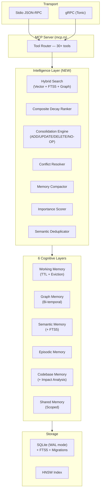
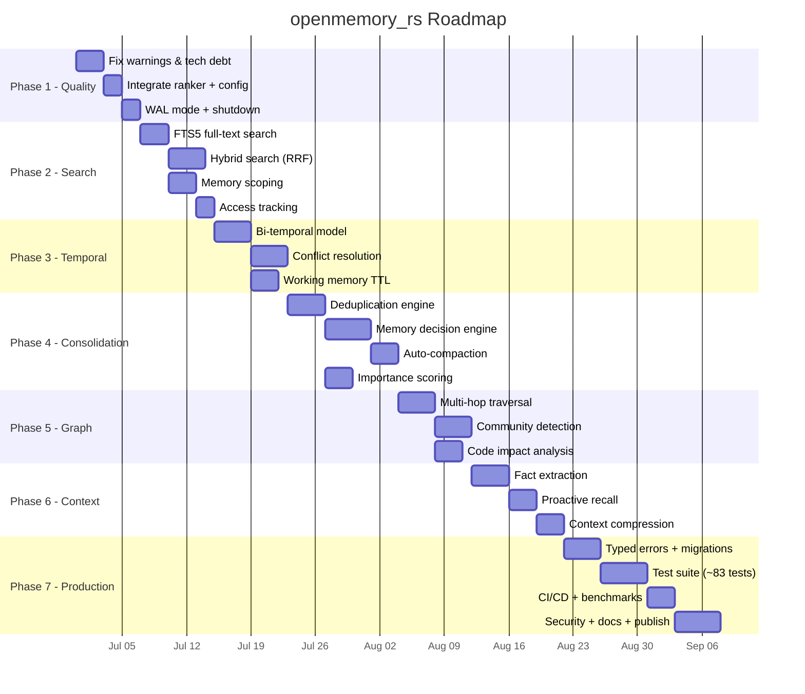

# openmemory_rs — Implementation Plan v2

> **Last Updated:** 2026-06-26
> **Version:** 0.1.1 → 1.0.0 roadmap
> **Constraints:**
> - Pure MCP server for AI agents. No web UI, no dashboard, no browser-facing features.
> - **100% pure Rust.** Zero Python, Node.js, or external language runtime dependencies.
> - **Zero LLM/API calls.** All intelligence (dedup, consolidation, extraction, compression) is algorithmic — cosine similarity, BM25, regex, heuristics. No cloud APIs.
> - All dependencies must be Rust crates only.

---

## Pure Rust Architecture Principles

Every feature in this plan MUST be implemented using only Rust crates. Here's how we achieve parity with Python/TS competitors without their runtimes:

| Capability | Competitors Use | We Use (Pure Rust) |
|:---|:---|:---|
| Embeddings | OpenAI API, sentence-transformers | `fastembed` (local ONNX, already integrated) |
| Vector search | Qdrant, Pinecone, ChromaDB | `small-world-rs` HNSW (already integrated) |
| Full-text search | Elasticsearch, Typesense | `rusqlite` FTS5 (SQLite built-in) |
| Knowledge graph | Neo4j, FalkorDB | `petgraph` + SQLite (already integrated) |
| Text processing | spaCy, NLTK | `regex`, `unicode-segmentation`, custom Rust parsers |
| Fact extraction | LLM API calls | Rule-based regex patterns + entity heuristics |
| Deduplication | LLM semantic comparison | Cosine similarity threshold on local embeddings |
| Conflict resolution | LLM reasoning | Temporal precedence + confidence scoring algorithms |
| Context compression | LLM summarization | TF-IDF keyword extraction + sentence scoring |
| Community detection | NetworkX (Python) | `petgraph` connected components + modularity |
| BM25 scoring | rank-bm25 (Python) | Custom Rust BM25 impl or `bm25` crate |
| Serialization | JSON (serde) | `serde` + `serde_json` (already integrated) |
| AST parsing | tree-sitter bindings | `tree-sitter` Rust crate (already integrated) |
| Async runtime | asyncio (Python) | `tokio` (already integrated) |
| gRPC | grpcio (Python) | `tonic` + `prost` (already integrated) |
| Encryption | cryptography (Python) | `aes-gcm` + `argon2` Rust crates |
| Date/time | datetime (Python) | `chrono` (already integrated) |

### New Rust Crate Dependencies (planned)

```toml
# Phase 2 — Hybrid Search
unicode-segmentation = "1.11"    # Sentence/word splitting

# Phase 4 — Consolidation  
rust-stemmers = "1.2"            # Word stemming for dedup
stop-words = "0.8"               # Stop word removal

# Phase 6 — Context Intelligence
regex = "1.10"                   # Pattern matching for fact extraction

# Phase 7 — Security
aes-gcm = "0.10"                 # AES-256-GCM encryption at rest
argon2 = "0.5"                   # Key derivation
rand = "0.8"                     # Nonce generation
```

---

## Reference Projects & Inspiration

These projects were studied to inform this plan. Each brings specific features worth adopting.

| Project | GitHub | Language | Key Feature to Steal |
|:---|:---|:---|:---|
| Mem0 | [github.com/mem0ai/mem0](https://github.com/mem0ai/mem0) | Python | Memory decision engine (ADD/UPDATE/DELETE/NO-OP), memory scoping (user/session/agent), context compression |
| Letta (MemGPT) | [github.com/letta-ai/letta](https://github.com/letta-ai/letta) | Python | OS-inspired tiered memory, autonomous self-editing, archival memory paging |
| Zep / Graphiti | [github.com/getzep/graphiti](https://github.com/getzep/graphiti) | Python | Bi-temporal knowledge graph, conflict resolution, community summarization, hybrid retrieval |
| AgentMemory | [github.com/rohitg00/agentmemory](https://github.com/rohitg00/agentmemory) | TypeScript | BM25 + embeddings hybrid search, auto-capture hooks, ~92% context reduction |
| memory-mcp-rs | [github.com/ssoj13/memory-mcp-rs](https://github.com/ssoj13/memory-mcp-rs) | Rust | SQLite FTS5 full-text search, ACID knowledge graph |
| engram-mcp | [github.com/edg-l/engram-mcp](https://github.com/edg-l/engram-mcp) | Rust | Branch-aware sessions, local ONNX embeddings |
| neo4j-graphrag | [github.com/neo4j/neo4j-graphrag-python](https://github.com/neo4j/neo4j-graphrag-python) | Python | Multi-hop graph traversal, entity linking, community detection |
| rmcp (official SDK) | [github.com/modelcontextprotocol/rust-sdk](https://github.com/modelcontextprotocol/rust-sdk) | Rust | Latest MCP protocol patterns, tool macros |
| FastMCP Rust | [github.com/Dicklesworthstone/fastmcp_rust](https://github.com/Dicklesworthstone/fastmcp_rust) | Rust | Zero-copy serialization, cancel-correct async |
| FalkorDB | [github.com/FalkorDB/FalkorDB](https://github.com/FalkorDB/FalkorDB) | C | Ultra-low-latency graph queries, Cypher support |

---

## Current State (v0.1.1) — What We Have

### Module Inventory

| Module | Lines | Status | Notes |
|:---|:---:|:---|:---|
| `src/main.rs` | 41 | ✅ Complete | Stdio + gRPC routing |
| `src/config.rs` | 15 | ⚠️ Unused | Config struct defined but never read from main |
| `src/coordinator.rs` | 132 | ✅ Complete | Arc pointers to 6 layers, branching |
| `src/mcp.rs` | 1199 | ✅ Complete | 22 MCP tools, tree-sitter, gRPC bridge |
| `src/layers/working.rs` | 28 | ⚠️ Minimal | No TTL, no persistence, no eviction |
| `src/layers/graph.rs` | 337 | ✅ Complete | Entity/Relation CRUD |
| `src/layers/semantic.rs` | 322 | ✅ Complete | HNSW + fastembed, but no hybrid search |
| `src/layers/episodic.rs` | 255 | ✅ Complete | Episodes, reflections, tool perf |
| `src/layers/codebase.rs` | 276 | ✅ Complete | AST indexing, call graph, evolution |
| `src/layers/shared.rs` | 111 | ✅ Complete | Cross-agent key-value board |
| `src/search/ranker.rs` | 23 | ⚠️ Not integrated | Ranker exists but never called |
| `tests/test_grpc.rs` | 178 | ✅ Complete | gRPC integration test |

### Technical Debt

| Issue | Severity | Effort |
|:---|:---|:---|
| 55 camelCase compiler warnings | Low | 1 hour |
| Ranker not integrated into semantic queries | High | 2 hours |
| Config struct unused from main.rs | Low | 30 min |
| HNSW index stored as single BLOB | Medium | 1 day |
| No connection pooling (single Mutex per layer) | Medium | 2 days |
| search_nodes scans all edges O(n) | Medium | 2 hours |
| codebase_signatures table created but unused | Low | 1 hour |
| Working memory has no persistence or TTL | High | 1 day |
| No graceful shutdown handling | Medium | 2 hours |
| No SQLite WAL mode | Medium | 30 min |

---

## Phase 1: Code Quality & Foundation Fixes (COMPLETED)

**Goal:** Clean up technical debt, fix warnings, integrate existing unused code.
**Duration:** 1 week
**Branch:** `phase1/hardening`

### Tasks

#### 1.1 Fix Compiler Warnings
- Add `#[allow(non_snake_case)]` on MCP input structs or rename fields
- Add `#[serde(rename_all = "camelCase")]` where JSON compatibility requires it
- Target: zero warnings on `cargo build`

#### 1.2 Integrate the Composite Decay Ranker
**Inspiration:** Every competitor ranks results by relevance+recency. Our ranker exists but is dead code.

```
Score = α·Similarity + β·Recency + γ·Importance + δ·SuccessRate
Recency = e^(-0.01 · elapsed_hours)
```

- Wire `Ranker::score()` into `SemanticMemory::query_similar_facts()`
- Add `importance` and `success_rate` metadata to semantic facts
- Return results sorted by composite score, not raw cosine similarity

#### 1.3 Integrate Config Module
- Read `MEMORY_DB_PATH`, `EMBEDDING_MODEL`, `RUST_LOG` from env vars via `Config`
- Pass `Config` to `MemoryCoordinator::new()` instead of hardcoded defaults

#### 1.4 Enable SQLite WAL Mode
```rust
conn.execute_batch("PRAGMA journal_mode=WAL; PRAGMA synchronous=NORMAL;")?;
```
- Enables concurrent reads while writing
- ~3x read performance improvement

#### 1.5 Add Graceful Shutdown
- Handle `SIGTERM`/`SIGINT` via `tokio::signal`
- Flush WAL, close connections cleanly
- Dump HNSW index before exit

#### 1.6 Fix search_nodes Edge Scan
- Replace O(n) in-memory edge filtering with proper SQL JOIN:
```sql
SELECT DISTINCT gn.* FROM graph_nodes gn
JOIN graph_edges ge ON gn.name = ge.source OR gn.name = ge.target
WHERE gn.name LIKE ? OR gn.entity_type LIKE ?
```

---

## Phase 2: Hybrid Search & Memory Scoping

**Goal:** Add the two most impactful missing features — hybrid retrieval and memory scoping.
**Duration:** 2 weeks
**Branch:** `phase2/hybrid-search`

### Tasks

#### 2.1 Add FTS5 Full-Text Search
**Ref:** [memory-mcp-rs](https://github.com/ssoj13/memory-mcp-rs) uses SQLite FTS5 as its primary retrieval mechanism.

```sql
CREATE VIRTUAL TABLE semantic_fts USING fts5(
    fact_id,
    fact_text,
    content=semantic_metadata,
    content_rowid=rowid
);

-- Triggers to keep FTS in sync
CREATE TRIGGER semantic_fts_insert AFTER INSERT ON semantic_metadata BEGIN
    INSERT INTO semantic_fts(rowid, fact_id, fact_text) VALUES (new.rowid, new.id, new.fact);
END;
```

- Add FTS5 table creation to `SemanticMemory::new()`
- Keep FTS index in sync via SQLite triggers
- Expose via `search_text` method on SemanticMemory

#### 2.2 Implement Reciprocal Rank Fusion (RRF)
**Ref:** [Zep/Graphiti](https://github.com/getzep/graphiti) uses hybrid retrieval with score fusion.

```rust
// src/search/hybrid.rs
pub struct HybridSearcher;

impl HybridSearcher {
    pub fn fuse_results(
        vector_results: Vec<(String, f64)>,  // (id, cosine_score)
        fts_results: Vec<(String, f64)>,      // (id, bm25_score)
        graph_results: Vec<(String, f64)>,    // (id, hop_score)
        k: f64,                                // RRF constant (default: 60.0)
    ) -> Vec<(String, f64)> {
        // RRF: score = Σ 1/(k + rank_i)
    }
}
```

- New module: `src/search/hybrid.rs`
- Combine vector (HNSW), keyword (FTS5), and graph (edge proximity) results
- Modify `query_similar_facts` to use hybrid by default

#### 2.3 Add Memory Scoping
**Ref:** [Mem0](https://github.com/mem0ai/mem0) scopes memories to user/session/agent.

Add scope columns to ALL memory tables:

```sql
ALTER TABLE semantic_metadata ADD COLUMN user_id TEXT DEFAULT '*';
ALTER TABLE semantic_metadata ADD COLUMN session_id TEXT DEFAULT '*';
ALTER TABLE semantic_metadata ADD COLUMN agent_id TEXT DEFAULT '*';
-- Same for: graph_nodes, graph_edges, episodic_logs, reflection_memory,
--           tool_performance, code_elements, shared_agent_memory
```

- All query tools get optional `user_id`, `session_id`, `agent_id` filter params
- Default `'*'` means "global / accessible by all"
- Scoping is purely filter-based — zero overhead when not used

#### 2.4 Add Memory Access Tracking
```sql
CREATE TABLE memory_access_log (
    id TEXT PRIMARY KEY,
    memory_id TEXT NOT NULL,
    memory_layer TEXT NOT NULL,  -- 'semantic', 'graph', 'episodic', etc.
    accessed_at TEXT NOT NULL,
    accessed_by TEXT,            -- agent_id
    access_type TEXT NOT NULL    -- 'read', 'write', 'search_hit'
);
```

- Log every read/search hit
- Feed into importance scoring (Phase 3)
- Enables "most accessed memories" analytics via MCP tool

---

## Phase 3: Temporal Intelligence & Conflict Resolution

**Goal:** Make memory time-aware and self-correcting.
**Duration:** 2 weeks
**Branch:** `phase3/temporal`

### Tasks

#### 3.1 Bi-temporal Fact Model
**Ref:** [Zep/Graphiti](https://github.com/getzep/graphiti) is the gold standard for temporal knowledge graphs.

Add temporal columns to graph edges:

```sql
ALTER TABLE graph_edges ADD COLUMN valid_from TEXT;     -- when fact became true
ALTER TABLE graph_edges ADD COLUMN valid_until TEXT;     -- when fact stopped being true (NULL = current)
ALTER TABLE graph_edges ADD COLUMN superseded_by TEXT;   -- UUID of replacing edge
ALTER TABLE graph_edges ADD COLUMN confidence REAL DEFAULT 1.0;
```

Add to semantic metadata:

```sql
ALTER TABLE semantic_metadata ADD COLUMN valid_from TEXT;
ALTER TABLE semantic_metadata ADD COLUMN valid_until TEXT;
ALTER TABLE semantic_metadata ADD COLUMN superseded_by TEXT;
```

#### 3.2 New MCP Tools — Temporal Operations

```
invalidate_fact
  Input: { fact_id: String, reason: String }
  Action: Sets valid_until = NOW, preserves historical record

query_fact_history
  Input: { entity_name: String, relation_type: Option<String> }
  Output: Chronological list of all versions of facts about an entity

query_as_of
  Input: { query: String, as_of: String (ISO datetime) }
  Output: Facts that were valid at the specified point in time
```

#### 3.3 Conflict Resolution Engine
**Ref:** [Zep/Graphiti](https://github.com/getzep/graphiti) detects and resolves contradictions automatically.

New module: `src/search/conflict.rs`

```rust
pub struct ConflictResolver;

impl ConflictResolver {
    /// Detect contradictions: same entity+relation, different values
    pub fn detect_conflicts(graph: &GraphMemory) -> Vec<ConflictPair>;

    /// Resolve by temporal precedence (newest wins)
    pub fn resolve_by_recency(conflict: &ConflictPair, graph: &mut GraphMemory) -> Resolution;

    /// Resolve by confidence score
    pub fn resolve_by_confidence(conflict: &ConflictPair) -> Resolution;
}
```

New MCP tool:
```
detect_and_resolve_conflicts
  Input: { strategy: "recency" | "confidence" | "manual", entity_filter: Option<String> }
  Output: List of conflicts found and resolutions applied
```

#### 3.4 Working Memory TTL & Eviction
**Ref:** [Letta/MemGPT](https://github.com/letta-ai/letta) manages working memory with automatic eviction.

```rust
// src/layers/working.rs — enhanced
pub struct WorkingMemory {
    store: RwLock<HashMap<String, WorkingEntry>>,
    default_ttl: Duration,  // configurable, default 1 hour
}

pub struct WorkingEntry {
    value: String,
    created_at: Instant,
    ttl: Duration,
    access_count: u32,
}

impl WorkingMemory {
    pub fn get(&self, key: &str) -> Option<String> {
        // Return None if expired, increment access_count otherwise
    }

    pub fn evict_expired(&self) -> usize {
        // Remove all entries past their TTL
    }

    pub fn promote_to_semantic(&self, key: &str, semantic: &SemanticMemory) {
        // Move important working memory to long-term storage before eviction
    }
}
```

---

## Phase 4: Memory Consolidation Engine

**Goal:** Transform from "store everything" to "know what to remember." This is the #1 feature gap vs competitors.
**Duration:** 3 weeks
**Branch:** `phase4/consolidation`

### Tasks

#### 4.1 Semantic Deduplication
**Ref:** [Mem0](https://github.com/mem0ai/mem0) deduplicates facts before storage.

```rust
// src/search/dedup.rs
pub struct Deduplicator;

impl Deduplicator {
    /// Check if a new fact is semantically duplicate of existing facts
    /// Uses cosine similarity threshold (default: 0.92)
    pub fn find_duplicates(
        new_fact: &str,
        semantic: &SemanticMemory,
        threshold: f64,
    ) -> Vec<DuplicateMatch>;

    /// Merge two facts into a consolidated version
    pub fn merge_facts(fact_a: &str, fact_b: &str) -> String;
}
```

#### 4.2 Memory Decision Engine
**Ref:** [Mem0](https://github.com/mem0ai/mem0) — the most impactful feature to adopt.

New module: `src/consolidation/engine.rs`

```rust
pub enum MemoryDecision {
    Add,                          // New, unique information
    Update { existing_id: String }, // Enriches existing memory
    Delete { target_id: String },   // Contradicts/supersedes existing
    NoOp,                          // Already known, skip
}

pub struct ConsolidationEngine;

impl ConsolidationEngine {
    /// Analyze a new piece of information against existing memories
    pub fn decide(
        new_info: &str,
        semantic: &SemanticMemory,
        graph: &GraphMemory,
        similarity_threshold: f64,  // 0.92 for duplicates
    ) -> MemoryDecision;
}
```

New MCP tool:
```
smart_store
  Input: { content: String, layer: "auto" | "semantic" | "graph" | "episodic" }
  Action: Runs decision engine, then ADD/UPDATE/DELETE/NO-OP
  Output: { decision: String, affected_ids: Vec<String>, details: String }
```

#### 4.3 Auto-compaction / Garbage Collection
```rust
// src/consolidation/compactor.rs
pub struct MemoryCompactor;

impl MemoryCompactor {
    /// Remove memories with importance < threshold and age > max_age
    pub fn compact_by_decay(
        semantic: &SemanticMemory,
        min_importance: f64,
        max_age_hours: f64,
    ) -> CompactionReport;

    /// Merge clusters of similar memories into summaries
    pub fn consolidate_clusters(
        semantic: &SemanticMemory,
        cluster_threshold: f64,  // cosine similarity for clustering
    ) -> ConsolidationReport;
}
```

New MCP tool:
```
compact_memories
  Input: { strategy: "decay" | "cluster" | "both", dry_run: bool }
  Output: { removed: u32, merged: u32, freed_bytes: u64 }
```

#### 4.4 Auto-importance Scoring
**Ref:** [Mem0](https://github.com/mem0ai/mem0) + [Letta](https://github.com/letta-ai/letta) — both auto-calculate importance.

```rust
// src/search/importance.rs
pub fn calculate_importance(
    access_count: u32,
    edge_count: u32,       // graph connectivity
    age_hours: f64,
    was_reinforced: bool,   // explicitly confirmed by agent
) -> f64 {
    let access_score = (access_count as f64 + 1.0).ln() / 10.0;
    let connection_score = (edge_count as f64 + 1.0).ln() / 5.0;
    let freshness = (-0.005 * age_hours).exp();
    let reinforcement = if was_reinforced { 0.3 } else { 0.0 };
    (access_score + connection_score + freshness + reinforcement).min(1.0)
}
```

- Run importance recalculation on every read (lazy) or via periodic sweep
- Integrate with ranker's `importance` field
- Feed into compaction decisions

---

## Phase 5: Advanced Graph Intelligence

**Goal:** Make the knowledge graph queryable with multi-hop reasoning and structural analysis.
**Duration:** 2 weeks
**Branch:** `phase5/graph-intelligence`

### Tasks

#### 5.1 Multi-hop Graph Traversal
**Ref:** [neo4j-graphrag](https://github.com/neo4j/neo4j-graphrag-python) and [FalkorDB](https://github.com/FalkorDB/FalkorDB) — both support multi-hop queries.

```rust
// src/layers/graph_traversal.rs
use petgraph::algo::{dijkstra, astar};
use petgraph::visit::Bfs;

pub struct GraphTraverser;

impl GraphTraverser {
    /// BFS from a starting entity, return all entities within N hops
    pub fn bfs_traverse(
        graph: &GraphMemory,
        start_entity: &str,
        max_hops: u32,
        relation_filter: Option<&str>,
    ) -> Vec<TraversalResult>;

    /// Find shortest path between two entities
    pub fn shortest_path(
        graph: &GraphMemory,
        from: &str,
        to: &str,
    ) -> Option<Vec<PathStep>>;

    /// Find all entities connected by a chain of specific relation types
    pub fn relation_chain(
        graph: &GraphMemory,
        start: &str,
        relation_sequence: &[String],
    ) -> Vec<Vec<String>>;
}
```

New MCP tools:
```
traverse_graph
  Input: { start_entity, max_hops, relation_filter? }
  Output: All reachable entities with paths

find_path
  Input: { from_entity, to_entity }
  Output: Shortest path with relations

find_related_by_chain
  Input: { start_entity, relation_sequence: ["works_on", "uses", "depends_on"] }
  Output: Entities matching the relation chain
```

#### 5.2 Community Detection & Summarization
**Ref:** [Zep/Graphiti](https://github.com/getzep/graphiti) builds hierarchical summaries from graph communities.

```rust
// src/search/community.rs
pub struct CommunityDetector;

impl CommunityDetector {
    /// Detect clusters using connected components + modularity
    pub fn detect_communities(graph: &GraphMemory) -> Vec<Community>;

    /// Generate a text summary for each community
    pub fn summarize_community(community: &Community) -> String;
}
```

New MCP tool:
```
analyze_graph_communities
  Input: { min_community_size: u32 }
  Output: List of communities with member entities and auto-generated summaries
```

#### 5.3 Recursive Code Impact Analysis
Extend the codebase layer to answer "if I change function X, what breaks?"

```rust
// Extend src/layers/codebase.rs
impl CodebaseMemory {
    /// Find all functions/types that directly or transitively depend on a given symbol
    pub fn impact_analysis(
        &self,
        symbol_name: &str,
        max_depth: u32,
    ) -> Vec<ImpactResult>;
}
```

New MCP tool:
```
analyze_code_impact
  Input: { symbol_name: String, max_depth: u32 }
  Output: List of affected symbols with dependency paths and change risk levels
```

---

## Phase 6: Context Intelligence & Agent Optimization

**Goal:** Help agents use memory more efficiently — compress context, extract facts, optimize token usage.
**Duration:** 2 weeks
**Branch:** `phase6/context-intelligence`

### Tasks

#### 6.1 Fact Extraction from Conversation (Pure Rust, Zero LLM)
**Ref:** [Mem0](https://github.com/mem0ai/mem0) extracts durable facts from verbose chat. [AgentMemory](https://github.com/rohitg00/agentmemory) does auto-capture.

**Implementation: 100% algorithmic, no LLM calls.** Uses `regex` crate for pattern matching and `unicode-segmentation` for sentence splitting.

```rust
// src/extraction/fact_extractor.rs — pure Rust, no external APIs
use regex::Regex;
use unicode_segmentation::UnicodeSegmentation;

pub struct FactExtractor {
    // Precompiled regex patterns for relation detection
    relation_patterns: Vec<(Regex, &'static str)>,  // (pattern, relation_type)
}

impl FactExtractor {
    pub fn new() -> Self {
        Self {
            relation_patterns: vec![
                (Regex::new(r"(\w+)\s+(?:uses?|using)\s+(\w+)").unwrap(), "uses"),
                (Regex::new(r"(\w+)\s+(?:depends?\s+on|requires?)\s+(\w+)").unwrap(), "depends_on"),
                (Regex::new(r"(\w+)\s+(?:prefers?|likes?|favou?rs?)\s+(\w+)").unwrap(), "prefers"),
                (Regex::new(r"(\w+)\s+(?:is\s+a|is\s+an|is\s+the)\s+(\w+)").unwrap(), "is_a"),
                (Regex::new(r"(\w+)\s+(?:works?\s+(?:on|with|at))\s+(\w+)").unwrap(), "works_with"),
                (Regex::new(r"(\w+)\s+(?:created?|built?|wrote?)\s+(\w+)").unwrap(), "created"),
            ],
        }
    }

    /// Split text into sentences, extract entities + relations, no LLM involved
    pub fn extract(&self, text: &str) -> Vec<ExtractedFact>;
}
```

New MCP tool:
```
extract_and_store_facts
  Input: { conversation_text: String, scope: { user_id?, session_id?, agent_id? } }
  Action:
    1. Split text into sentences (unicode_segmentation)
    2. Identify entity mentions via capitalization + code identifier heuristics
    3. Match relation patterns via precompiled regex
    4. Run cosine similarity dedup check against existing memories
    5. Store via consolidation engine (ADD/UPDATE/DELETE/NO-OP)
  Output: { facts_extracted: u32, stored: u32, duplicates_skipped: u32, updated: u32 }
  
  ⚠️ NO LLM calls. All extraction is regex + heuristic based.
```

#### 6.2 Proactive Memory Recall
**Ref:** [Letta/MemGPT](https://github.com/letta-ai/letta) proactively surfaces relevant context.

New MCP tool:
```
proactive_recall
  Input: { current_context: String, max_results: u32, layers: ["semantic", "graph", "episodic"] }
  Action: Run hybrid search across all specified layers, fuse results, return most relevant
  Output: Ranked list of memories from all layers with source attribution
```

#### 6.3 Memory Statistics & Health Check
New MCP tool (replaces need for any UI):
```
memory_stats
  Input: {}
  Output: {
    total_semantic_facts: u32,
    total_graph_entities: u32,
    total_graph_edges: u32,
    total_episodes: u32,
    total_reflections: u32,
    total_code_elements: u32,
    db_size_bytes: u64,
    hnsw_index_size: u64,
    oldest_memory: String,
    newest_memory: String,
    most_accessed_memories: Vec<MemoryItem>,
    stale_memory_count: u32,  // importance < 0.1
  }
```

#### 6.4 Context Compression (Pure Rust TF-IDF, Zero LLM)
**Ref:** [Mem0](https://github.com/mem0ai/mem0) achieves ~92% context reduction.

**Implementation: 100% algorithmic.** Uses TF-IDF sentence scoring + stop-word removal + dedup against stored memories. No LLM summarization.

```rust
// src/extraction/compressor.rs — pure Rust, no external APIs
use rust_stemmers::{Algorithm, Stemmer};
use stop_words::{get, LANGUAGE};

pub struct ContextCompressor {
    stemmer: Stemmer,
    stop_words: Vec<String>,
}

impl ContextCompressor {
    /// Score each sentence by TF-IDF relevance, keep top N
    pub fn compress(&self, text: &str, target_ratio: f64) -> CompressedResult {
        let sentences = split_sentences(text);
        let tf_idf_scores = self.score_sentences(&sentences);
        let keep_count = (sentences.len() as f64 * target_ratio).ceil() as usize;
        // Keep highest-scoring sentences in original order
        // Remove stop words from remaining text
        // Deduplicate against stored memories via cosine similarity
    }
}
```

New MCP tool:
```
compress_context
  Input: { text: String, target_ratio: f64 }
  Action:
    1. Split into sentences (unicode_segmentation)
    2. Score sentences via TF-IDF (rust-stemmers + stop-words crates)
    3. Keep top N sentences by score (N = sentence_count × target_ratio)
    4. Remove stop words and filler from kept sentences
    5. Deduplicate against existing memories (cosine similarity via fastembed)
  Output: { compressed_text: String, original_tokens: u32, compressed_tokens: u32, ratio: f64 }
  
  ⚠️ NO LLM calls. Uses TF-IDF scoring, stop-word removal, and stemming.
```


---

## Phase 7: Production Hardening

**Goal:** Make it production-ready for crates.io publication.
**Duration:** 3 weeks
**Branch:** `phase7/production`

### Tasks

#### 7.1 Typed Error Handling
Replace all `anyhow::bail!` with typed errors:

```rust
// src/error.rs
#[derive(Debug, thiserror::Error)]
pub enum MemoryError {
    #[error("Database error: {0}")]
    Database(#[from] rusqlite::Error),
    #[error("Embedding error: {0}")]
    Embedding(String),
    #[error("HNSW index error: {0}")]
    Index(String),
    #[error("Entity not found: {0}")]
    NotFound(String),
    #[error("Conflict detected: {0}")]
    Conflict(String),
    #[error("Branch error: {0}")]
    Branch(String),
    #[error("Invalid input: {0}")]
    Validation(String),
}
```

#### 7.2 Database Migration System

```rust
// src/db/migrations.rs
const MIGRATIONS: &[(&str, &str)] = &[
    ("001_initial", include_str!("migrations/001_initial.sql")),
    ("002_fts5", include_str!("migrations/002_fts5.sql")),
    ("003_temporal", include_str!("migrations/003_temporal.sql")),
    ("004_scoping", include_str!("migrations/004_scoping.sql")),
    ("005_access_log", include_str!("migrations/005_access_log.sql")),
];

pub fn run_migrations(conn: &Connection) -> Result<()>;
```

#### 7.3 Comprehensive Test Suite

| Area | Test Count | Priority |
|:---|:---:|:---|
| Graph CRUD (entity/relation/observation) | 12 | P0 |
| Semantic add/query/dedup | 8 | P0 |
| Hybrid search (FTS5 + vector + graph) | 6 | P0 |
| Episodic log/reflect/tool-perf | 8 | P0 |
| Codebase index/query/impact | 6 | P1 |
| Shared store/retrieve/scope | 4 | P1 |
| Working memory TTL/eviction | 4 | P1 |
| Consolidation engine decisions | 8 | P0 |
| Conflict resolution | 6 | P1 |
| Temporal queries (as_of, history) | 6 | P1 |
| Database branching lifecycle | 4 | P0 |
| Ranker integration | 3 | P1 |
| Graph traversal (BFS/path) | 4 | P2 |
| Memory compaction | 4 | P2 |
| **Total** | **~83** | |

#### 7.4 CI/CD Pipeline (GitHub Actions)

```yaml
# .github/workflows/ci.yml
jobs:
  check:
    - cargo fmt --check
    - cargo clippy -- -D warnings
    - cargo build --release
    - cargo test
  benchmark:
    - cargo bench  # criterion benchmarks
```

#### 7.5 Benchmarks (criterion)

| Operation | Target Latency |
|:---|:---|
| Semantic add fact | < 50ms |
| Semantic query (top 10) | < 10ms |
| FTS5 keyword search | < 1ms |
| Hybrid search (fused) | < 15ms |
| Graph entity create | < 1ms |
| Graph BFS (5 hops) | < 5ms |
| Working memory get | < 0.01ms |
| Consolidation decision | < 20ms |
| HNSW index rebuild (10k vectors) | < 2s |

#### 7.6 Security Hardening
- Input validation on all MCP tool inputs (max string lengths, allowed characters)
- SQL injection prevention audit (all queries use parameterized statements already, but audit)
- Memory encryption at rest (optional, via `MEMORY_ENCRYPT_KEY` env var)
- Per-agent access control (agent X can only read/write its own scoped memories)

#### 7.7 Documentation & Publishing
- `README.md` with quick start, MCP client config examples
- `CHANGELOG.md` for all releases
- API documentation via `cargo doc`
- Publish to crates.io
- Docker image (`FROM rust:alpine AS builder`)

---

## Architecture After All Phases



---

## New MCP Tools Summary (after all phases)

| # | Tool Name | Phase | Layer |
|:---|:---|:---:|:---|
| 23 | `search_text` | P2 | Semantic |
| 24 | `hybrid_search` | P2 | Cross-layer |
| 25 | `memory_stats` | P6 | System |
| 26 | `invalidate_fact` | P3 | Graph + Semantic |
| 27 | `query_fact_history` | P3 | Graph + Semantic |
| 28 | `query_as_of` | P3 | Graph + Semantic |
| 29 | `detect_and_resolve_conflicts` | P3 | Graph |
| 30 | `smart_store` | P4 | Cross-layer |
| 31 | `compact_memories` | P4 | Cross-layer |
| 32 | `traverse_graph` | P5 | Graph |
| 33 | `find_path` | P5 | Graph |
| 34 | `analyze_graph_communities` | P5 | Graph |
| 35 | `analyze_code_impact` | P5 | Codebase |
| 36 | `extract_and_store_facts` | P6 | Cross-layer |
| 37 | `proactive_recall` | P6 | Cross-layer |
| 38 | `compress_context` | P6 | Semantic |

**Total tools: 22 existing + 16 new = 38 MCP tools**

---

## Timeline



---

## Version Milestones

| Version | Phase | Key Deliverable |
|:---|:---|:---|
| **v0.2.0** | Phase 1 | Clean build, integrated ranker, WAL mode |
| **v0.3.0** | Phase 2 | Hybrid search (FTS5+vector), memory scoping |
| **v0.4.0** | Phase 3 | Temporal awareness, conflict resolution, working memory TTL |
| **v0.5.0** | Phase 4 | Consolidation engine (smart_store), dedup, compaction |
| **v0.6.0** | Phase 5 | Graph traversal, community detection, impact analysis |
| **v0.7.0** | Phase 6 | Fact extraction, proactive recall, context compression |
| **v1.0.0** | Phase 7 | Production-ready: typed errors, 83+ tests, CI/CD, crates.io |
