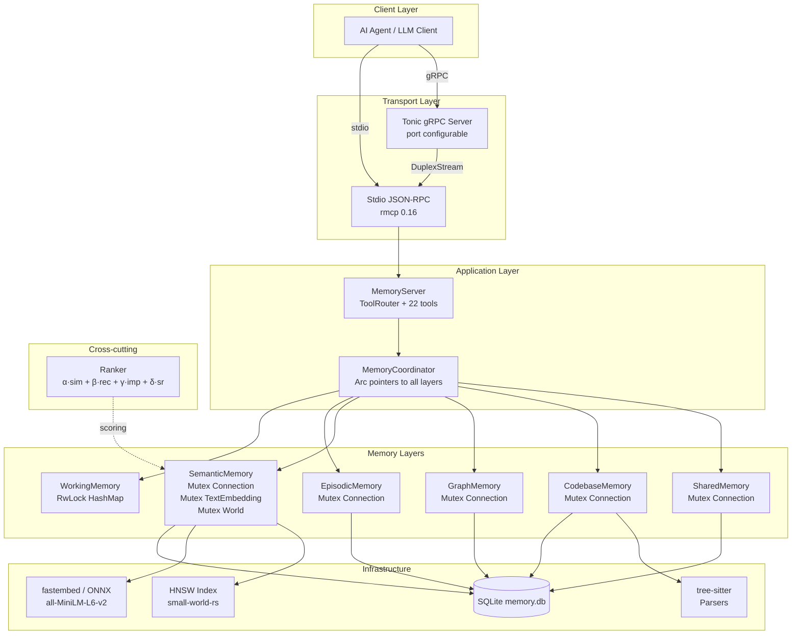
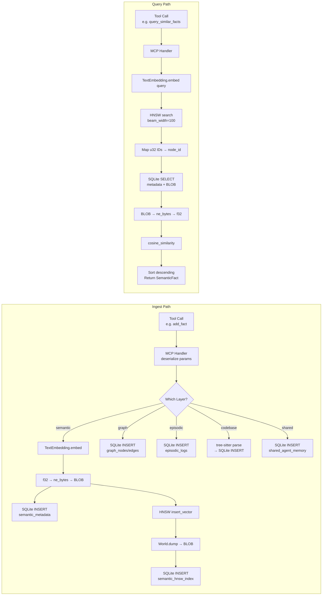
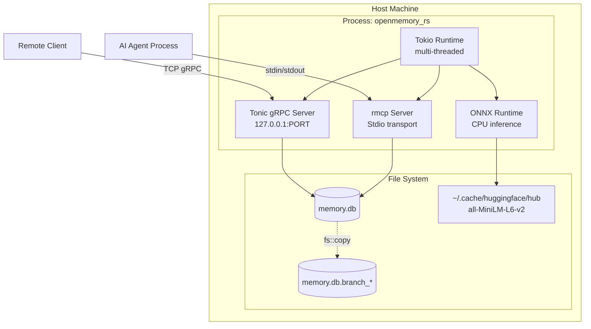
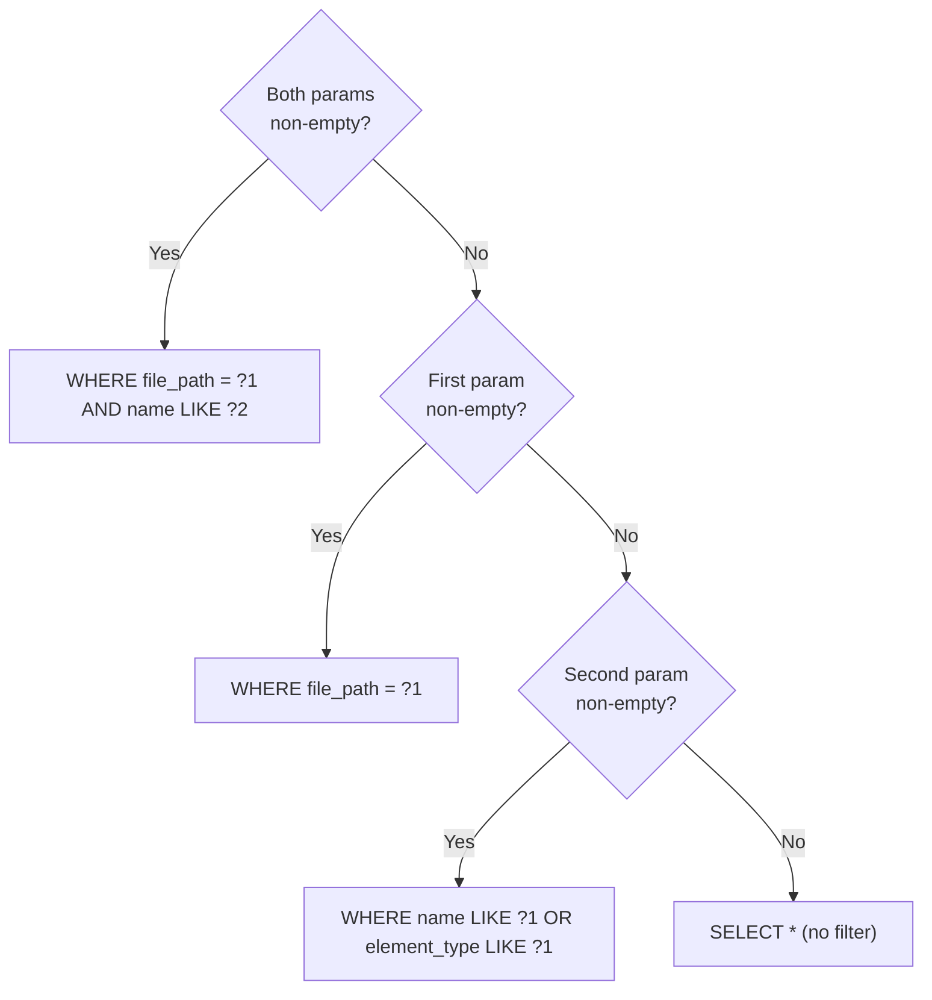
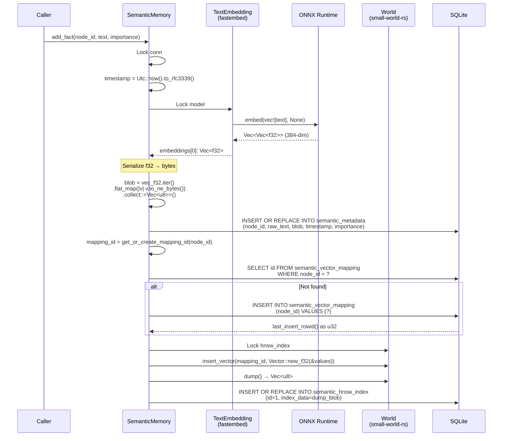
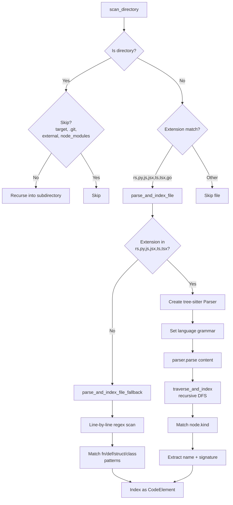
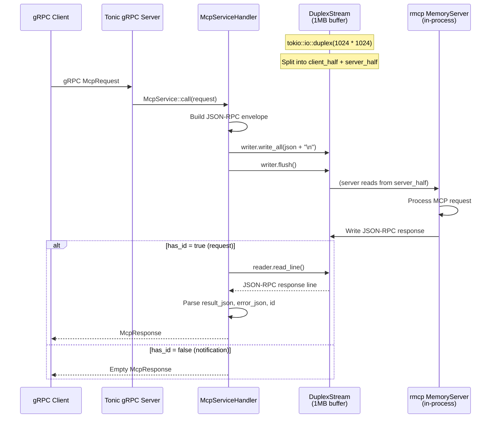
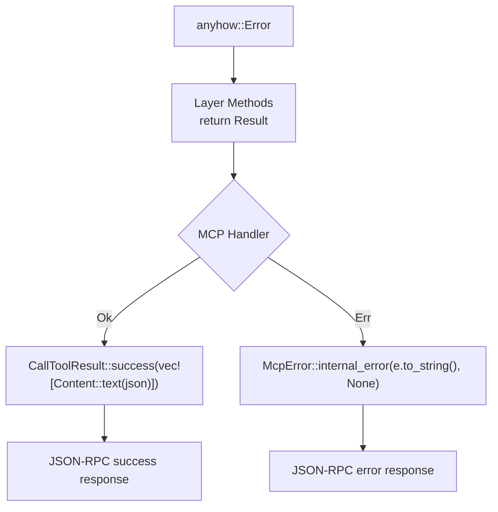
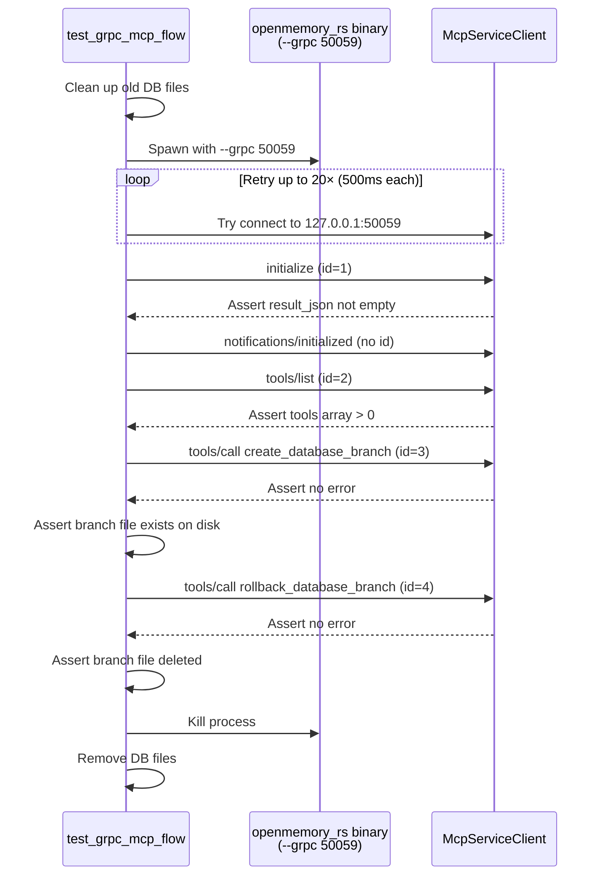

# openmemory_rs — Technical Specification

> **Version:** 0.1.1  
> **Edition:** Rust 2024  
> **Last Updated:** 2026-06-26  
> **Status:** Living Document

---

## Table of Contents

1. [Overview](#1-overview)
2. [System Architecture](#2-system-architecture)
3. [Module Specifications](#3-module-specifications)
4. [Concurrency Model](#4-concurrency-model)
5. [Embedding Pipeline](#5-embedding-pipeline)
6. [AST Parsing Pipeline](#6-ast-parsing-pipeline)
7. [gRPC Bridge Architecture](#7-grpc-bridge-architecture)
8. [Database Branching State Machine](#8-database-branching-state-machine)
9. [Error Handling Strategy](#9-error-handling-strategy)
10. [Testing Strategy](#10-testing-strategy)
11. [Build System](#11-build-system)

---

## 1. Overview

### 1.1 Scope

`openmemory_rs` is a high-performance, unified cognitive memory engine for AI agent frameworks, written entirely in Rust. It provides six independent memory layers — working, episodic, semantic, graph, codebase, and shared — coordinated behind a single binary that exposes both **Stdio JSON-RPC (MCP standard)** and **Tonic gRPC** transport interfaces.

The system is designed to run **100% locally** with zero cloud dependencies:

| Concern | Implementation |
|---|---|
| Storage | SQLite via `rusqlite` (bundled) — single `memory.db` file |
| Embeddings | `fastembed` 4.9.1 with `all-MiniLM-L6-v2` (384-dim), ONNX Runtime |
| Vector Index | HNSW via `small-world-rs` 1.1 |
| AST Parsing | `tree-sitter` 0.24 with Rust/Python/JS/TS/TSX grammars |
| Transport | `rmcp` 0.16 (Stdio) + `tonic` 0.11 (gRPC) |

### 1.2 Relationship to PRD

This specification is the authoritative technical reference for all implementation decisions. It details **how** each PRD requirement is fulfilled at the struct, method, SQL, and byte level. Where the PRD describes capabilities ("semantic search over memories"), this document describes the exact embedding pipeline, HNSW parameters, cosine similarity computation, and BLOB serialization format used.

### 1.3 Design Principles

1. **Single-binary deployment** — no sidecar processes, no external databases
2. **Zero-network operation** — all ML inference runs locally via ONNX
3. **Shared SQLite** — all five persistent layers share one `memory.db` file, one `Connection` per layer
4. **Branching isolation** — full database-level copy-on-branch with atomic commit/rollback
5. **MCP-first** — the Stdio JSON-RPC path is the primary transport; gRPC is a bridge adapter

---

## 2. System Architecture

### 2.1 Component Diagram



### 2.2 Data Flow Diagram



### 2.3 Deployment Diagram



---

## 3. Module Specifications

### 3.1 `main.rs` — Entrypoint (41 lines)

**Responsibility:** Parse CLI arguments, initialize logging, select transport, launch server.

```rust
// Pseudocode flow
fn main() -> Result<()> {
    env_logger::init();
    let db_path = env::var("MEMORY_DB_PATH").unwrap_or("memory.db");
    let coordinator = Arc::new(MemoryCoordinator::new(&db_path)?);
    
    if let Some(port) = parse_grpc_port_from_args() {
        mcp::run_grpc_server(coordinator, port).await?;
    } else {
        mcp::run_server(coordinator).await?;
    }
}
```

**CLI Interface:**

| Flag | Value | Default | Effect |
|---|---|---|---|
| `--grpc` | `<port: u16>` | None | Start gRPC transport instead of Stdio |
| `MEMORY_DB_PATH` | env var | `"memory.db"` | SQLite database file path |

### 3.2 `config.rs` — Configuration (15 lines)

```rust
pub struct Config {
    pub db_path: String,        // from MEMORY_DB_PATH or "memory.db"
    pub embedding_model: String, // from EMBEDDING_MODEL or "all-MiniLM-L6-v2"
}
```

**Note:** `Config::from_env()` is defined but the main entrypoint reads `MEMORY_DB_PATH` directly. The `Config` struct exists for future extensibility.

### 3.3 `coordinator.rs` — MemoryCoordinator (132 lines)

**Struct Definition:**

```rust
pub struct MemoryCoordinator {
    pub working:  Arc<WorkingMemory>,
    pub episodic: Arc<EpisodicMemory>,
    pub semantic: Arc<SemanticMemory>,
    pub graph:    Arc<GraphMemory>,
    pub codebase: Arc<CodebaseMemory>,
    pub shared:   Arc<SharedMemory>,
    pub base_db_path: String,
    pub active_branch: parking_lot::Mutex<Option<String>>,
}
```

**Methods:**

| Method | Signature | Description |
|---|---|---|
| `new` | `fn new(db_path: &str) -> Result<Self>` | Opens one `Connection` per layer against the same `db_path`, initializes HNSW index |
| `create_branch` | `fn create_branch(&self, branch_id: &str) -> Result<()>` | `fs::copy` base → branch file, switch all 5 persistent layers |
| `commit_branch` | `fn commit_branch(&self) -> Result<()>` | Switch to `:memory:`, `fs::copy` branch → base, delete branch file, switch back to base |
| `rollback_branch` | `fn rollback_branch(&self) -> Result<()>` | Switch all layers back to base, delete branch file |

**Key Invariant:** Only one branch can be active at a time. `create_branch` bails if `active_branch.is_some()`.

### 3.4 `mcp.rs` — MCP Server & Tool Handlers (1199 lines)

#### 3.4.1 MemoryServer Struct

```rust
#[derive(Clone)]
pub struct MemoryServer {
    coordinator: Arc<MemoryCoordinator>,
    tool_router: ToolRouter<Self>,
}
```

#### 3.4.2 Complete Tool Registry (22 Tools)

| # | Tool Name | Category | Input Struct | Layer |
|---|---|---|---|---|
| 1 | `create_entities` | Knowledge Graph | `CreateEntitiesInput` | graph |
| 2 | `create_relations` | Knowledge Graph | `CreateRelationsInput` | graph |
| 3 | `add_observations` | Knowledge Graph | `AddObservationsWrapper` | graph |
| 4 | `delete_entities` | Knowledge Graph | `DeleteEntitiesInput` | graph |
| 5 | `delete_observations` | Knowledge Graph | `DeleteObservationsWrapper` | graph |
| 6 | `delete_relations` | Knowledge Graph | `DeleteRelationsInput` | graph |
| 7 | `read_graph` | Knowledge Graph | `EmptyInput` | graph |
| 8 | `search_nodes` | Knowledge Graph | `SearchNodesInput` | graph |
| 9 | `open_nodes` | Knowledge Graph | `OpenNodesInput` | graph |
| 10 | `index_codebase` | Code Intelligence | `IndexCodebaseInput` | codebase |
| 11 | `query_code_graph` | Code Intelligence | `QueryCodeGraphInput` | codebase |
| 12 | `log_execution_episode` | Episodic | `LogEpisodeInput` | episodic |
| 13 | `log_reflection` | Episodic | `LogReflectionInput` | episodic |
| 14 | `retrieve_episodic_reflections` | Episodic | `RetrieveReflectionsInput` | episodic |
| 15 | `record_tool_performance` | Metrics | `RecordToolPerfInput` | episodic |
| 16 | `query_tool_performance` | Metrics | `QueryToolPerfInput` | episodic |
| 17 | `store_shared_team_memory` | Multi-Agent | `StoreSharedMemoryInput` | shared |
| 18 | `retrieve_shared_team_memory` | Multi-Agent | `RetrieveSharedMemoryInput` | shared |
| 19 | `log_repository_evolution` | Repository | `LogRepoEvolutionInput` | codebase |
| 20 | `query_repository_evolution` | Repository | `QueryRepoEvolutionInput` | codebase |
| 21 | `create_database_branch` | Branching | `BranchIdInput` | coordinator |
| 22 | `rollback_database_branch` | Branching | `EmptyInput` | coordinator |

> **Note:** `commit_database_branch` (tool #23 implied) also exists as an MCP tool using `EmptyInput`.

#### 3.4.3 Input Wrapper Structs

All input structs derive `serde::Deserialize` and `schemars::JsonSchema` for automatic MCP schema generation.

```rust
// Representative examples:
pub struct CreateEntitiesInput { pub entities: Vec<Entity> }
pub struct BranchIdInput       { pub branchId: String }
pub struct EmptyInput          { pub dummy: Option<bool> }
pub struct SearchNodesInput    { pub query: String }
pub struct LogEpisodeInput {
    pub id: Option<String>,
    pub taskDescription: String,
    pub executionStatus: String,
    pub stepsTaken: String,
    pub errorMessage: Option<String>,
    pub reflection: Option<String>,
}
```

#### 3.4.4 ServerHandler Implementation

```rust
impl rmcp::ServerHandler for MemoryServer {
    fn get_info(&self) -> ServerInfo {
        InitializeResult {
            capabilities: ServerCapabilities::builder().enable_tools().build(),
            ..Default::default()
        }
    }
}
```

### 3.5 `layers/working.rs` — Working Memory (28 lines)

```rust
pub struct WorkingMemory {
    session_data: RwLock<HashMap<String, String>>,
}
```

**Methods:**

| Method | Signature | Description |
|---|---|---|
| `new` | `fn new() -> Self` | Creates empty `RwLock<HashMap>` |
| `set` | `fn set(&self, key: &str, value: &str)` | Acquires write lock, inserts k-v pair |
| `get` | `fn get(&self, key: &str) -> Option<String>` | Acquires read lock, clones value |

**Design Note:** Uses `std::sync::RwLock` (not `parking_lot`) because working memory is purely in-memory and benefits from multiple concurrent readers. The `get` method gracefully handles poisoned locks via `.ok()`.

**No SQLite.** No `switch_connection`. Data is ephemeral to the process lifetime.

### 3.6 `layers/graph.rs` — Graph Memory (337 lines)

#### Struct Definitions

```rust
pub struct Entity {
    pub name: String,
    pub entityType: String,
    pub observations: Vec<String>,  // stored as JSON array in SQLite
}

pub struct Relation {
    pub from: String,
    pub to: String,
    pub relationType: String,
}

pub struct KnowledgeGraph {
    pub entities: Vec<Entity>,
    pub relations: Vec<Relation>,
}

pub struct GraphMemory {
    conn: Mutex<Connection>,  // parking_lot::Mutex
}
```

#### SQL Schema

```sql
CREATE TABLE IF NOT EXISTS graph_nodes (
    name TEXT PRIMARY KEY,
    entity_type TEXT NOT NULL,
    observations TEXT NOT NULL  -- JSON array
);

CREATE TABLE IF NOT EXISTS graph_edges (
    from_name TEXT NOT NULL,
    to_name TEXT NOT NULL,
    relation_type TEXT NOT NULL,
    PRIMARY KEY (from_name, to_name, relation_type)
);
```

#### Methods

| Method | Key SQL | Algorithm Notes |
|---|---|---|
| `create_entities` | `INSERT INTO graph_nodes` | Checks existence first via `SELECT EXISTS(...)`, skips duplicates |
| `create_relations` | `INSERT INTO graph_edges` | Checks existence, skips duplicates |
| `add_observations` | `UPDATE graph_nodes SET observations` | Deserializes JSON array, appends non-duplicate strings, re-serializes |
| `delete_entities` | `DELETE FROM graph_nodes` + `DELETE FROM graph_edges` | Cascading: removes edges where entity appears as either endpoint |
| `delete_observations` | `UPDATE graph_nodes SET observations` | Deserializes, filters out target observations, re-serializes |
| `delete_relations` | `DELETE FROM graph_edges` | Exact match on all three columns |
| `read_graph` | `SELECT * FROM graph_nodes` + `SELECT * FROM graph_edges` | Full scan, returns complete graph |
| `search_nodes` | `WHERE LOWER(name) LIKE ?1 OR LOWER(entity_type) LIKE ?1 OR LOWER(observations) LIKE ?1` | Case-insensitive LIKE across all three columns; returns related edges |
| `open_nodes` | `SELECT ... WHERE name = ?1` per name | Batch fetch specific nodes + their edges |
| `switch_connection` | N/A | Replaces `Mutex<Connection>` contents |

### 3.7 `layers/semantic.rs` — Semantic Memory (322 lines)

#### Struct Definitions

```rust
pub struct SemanticFact {
    pub node_id: String,
    pub raw_text: String,
    pub similarity: f64,
    pub timestamp: String,
    pub importance: f64,
}

pub struct SemanticMemory {
    conn: Mutex<Connection>,        // parking_lot::Mutex
    model: Mutex<TextEmbedding>,    // parking_lot::Mutex
    hnsw_index: Mutex<World>,       // parking_lot::Mutex
}
```

#### SQL Schema

```sql
CREATE TABLE IF NOT EXISTS semantic_metadata (
    node_id TEXT PRIMARY KEY,
    raw_text TEXT NOT NULL,
    embedding BLOB NOT NULL,       -- 384 × 4 = 1536 bytes
    timestamp TEXT NOT NULL,
    importance REAL NOT NULL DEFAULT 1.0
);

CREATE TABLE IF NOT EXISTS semantic_vector_mapping (
    id INTEGER PRIMARY KEY AUTOINCREMENT,  -- u32 HNSW key
    node_id TEXT UNIQUE NOT NULL
);

CREATE TABLE IF NOT EXISTS semantic_hnsw_index (
    id INTEGER PRIMARY KEY CHECK (id = 1),  -- singleton row
    index_data BLOB NOT NULL                -- serialized World
);
```

#### Methods

| Method | Description |
|---|---|
| `new(db_path)` | Opens connection, creates tables, initializes `TextEmbedding` model, loads or rebuilds HNSW from SQLite |
| `add_fact(node_id, text, importance)` | Full embedding pipeline: embed → serialize → SQLite INSERT → HNSW insert → dump → persist |
| `query_similar_facts(query, limit)` | Embed query → HNSW search → map IDs → load BLOBs → cosine similarity → sort |
| `switch_connection(db_path)` | Reopens connection, reloads/rebuilds HNSW, replaces both `Mutex` contents |

#### HNSW Parameters

```rust
// World::new(M, ef_construction, ef_search, metric)
World::new(32, 200, 100, DistanceMetric::Cosine(CosineDistance))
```

| Parameter | Value | Meaning |
|---|---|---|
| `M` | 32 | Max edges per node in HNSW graph |
| `ef_construction` | 200 | Candidate list size during insertion |
| `ef_search` (beam_width) | 100 | Candidate list size during query |
| Distance metric | Cosine | `CosineDistance` from `small-world-rs` |

### 3.8 `layers/episodic.rs` — Episodic Memory (255 lines)

#### Struct Definitions

```rust
pub struct EpisodeLog {
    pub id: String,
    pub task_description: String,
    pub execution_status: String,
    pub steps_taken: String,
    pub error_message: Option<String>,
    pub reflection: Option<String>,
    pub created_at: String,
}

pub struct ReflectionItem {
    pub id: String,
    pub task_description: String,
    pub status: String,             // "Success" or "Failed"
    pub attempt_number: i64,
    pub steps_taken: String,
    pub error_encountered: Option<String>,
    pub root_cause: Option<String>,
    pub solution_applied: Option<String>,
    pub reflection: String,
    pub created_at: String,
}

pub struct ToolPerformanceRecord {
    pub tool_name: String,
    pub model_name: String,
    pub task_type: String,
    pub success_count: i64,
    pub failure_count: i64,
    pub average_latency: f64,
    pub last_used: String,
}
```

#### SQL Schema

```sql
CREATE TABLE IF NOT EXISTS episodic_logs (
    id TEXT PRIMARY KEY,
    task_description TEXT NOT NULL,
    execution_status TEXT NOT NULL,
    steps_taken TEXT NOT NULL,
    error_message TEXT,
    reflection TEXT,
    created_at TEXT NOT NULL
);

CREATE TABLE IF NOT EXISTS reflection_memory (
    id TEXT PRIMARY KEY,
    task_description TEXT NOT NULL,
    status TEXT NOT NULL,
    attempt_number INTEGER NOT NULL,
    steps_taken TEXT NOT NULL,
    error_encountered TEXT,
    root_cause TEXT,
    solution_applied TEXT,
    reflection TEXT NOT NULL,
    created_at TEXT NOT NULL
);

CREATE TABLE IF NOT EXISTS tool_performance (
    tool_name TEXT NOT NULL,
    model_name TEXT NOT NULL,
    task_type TEXT NOT NULL,
    success_count INTEGER NOT NULL DEFAULT 0,
    failure_count INTEGER NOT NULL DEFAULT 0,
    average_latency REAL NOT NULL DEFAULT 0.0,
    last_used TEXT NOT NULL,
    PRIMARY KEY (tool_name, model_name, task_type)
);
```

#### Methods

| Method | Key Algorithm |
|---|---|
| `log_episode` | `INSERT OR REPLACE` with UUID id |
| `log_reflection` | `INSERT OR REPLACE` with UUID id |
| `get_reflections(query)` | If query empty: all rows `ORDER BY created_at DESC`. If query set: `LIKE %query%` across `task_description`, `reflection`, `root_cause` |
| `record_tool_performance` | **Running average**: if existing record found, computes `new_lat = (prev_total_lat + new_lat) / new_total_runs`. Uses compound PK `(tool_name, model_name, task_type)` |
| `query_tool_performance` | `WHERE task_type = ?1 ORDER BY success_count DESC, average_latency ASC` |

### 3.9 `layers/codebase.rs` — Codebase Memory (276 lines)

#### Struct Definitions

```rust
pub struct CodeElement {
    pub id: String,              // format: "path:name:start_line"
    pub file_path: String,
    pub element_type: String,    // Function, Struct, Method, Class, etc.
    pub name: String,
    pub signature: String,
    pub ast_json: Option<String>, // tree-sitter S-expression
    pub parent_id: Option<String>,
    pub start_line: i64,
    pub end_line: i64,
}

pub struct CodeCall {
    pub caller_id: String,
    pub callee_id: String,
    pub call_site: Option<String>,
}

pub struct RepositoryEvolution {
    pub file_path: String,
    pub version: String,
    pub commit_hash: Option<String>,
    pub author: Option<String>,
    pub change_type: String,     // "Added", "Modified", "Deleted"
    pub summary_of_changes: String,
    pub bug_introduced: bool,
    pub bug_fixed: bool,
    pub timestamp: String,
}
```

#### SQL Schema

```sql
CREATE TABLE IF NOT EXISTS codebase_signatures (
    id TEXT PRIMARY KEY,
    file_path TEXT NOT NULL,
    item_name TEXT NOT NULL,
    item_type TEXT NOT NULL,
    signature TEXT NOT NULL,
    dependencies TEXT
);

CREATE TABLE IF NOT EXISTS code_elements (
    element_id TEXT PRIMARY KEY,
    file_path TEXT NOT NULL,
    element_type TEXT NOT NULL,
    name TEXT NOT NULL,
    signature TEXT NOT NULL,
    ast_json TEXT,
    parent_id TEXT,
    start_line INTEGER NOT NULL,
    end_line INTEGER NOT NULL
);

CREATE TABLE IF NOT EXISTS code_calls (
    caller_id TEXT NOT NULL,
    callee_id TEXT NOT NULL,
    call_site TEXT,
    PRIMARY KEY (caller_id, callee_id)
);

CREATE TABLE IF NOT EXISTS repository_evolution (
    file_path TEXT NOT NULL,
    version TEXT NOT NULL,
    commit_hash TEXT,
    author TEXT,
    change_type TEXT NOT NULL,
    summary_of_changes TEXT NOT NULL,
    bug_introduced INTEGER NOT NULL DEFAULT 0,
    bug_fixed INTEGER NOT NULL DEFAULT 0,
    timestamp TEXT NOT NULL,
    PRIMARY KEY (file_path, version)
);
```

#### 4-Way Query Branching

Both `query_elements` and `query_calls` use a 4-way branching pattern based on which filter parameters are non-empty:



### 3.10 `layers/shared.rs` — Shared Memory (111 lines)

```rust
pub struct SharedMemoryItem {
    pub key: String,
    pub value: String,
    pub source_agent: String,
    pub target_agents: Vec<String>,  // JSON array in SQLite
    pub importance: f64,
    pub timestamp: String,
}
```

#### SQL Schema

```sql
CREATE TABLE IF NOT EXISTS shared_agent_memory (
    memory_key TEXT PRIMARY KEY,
    memory_value TEXT NOT NULL,
    source_agent TEXT NOT NULL,
    target_agents TEXT NOT NULL,     -- JSON array of agent IDs
    importance REAL NOT NULL DEFAULT 1.0,
    timestamp TEXT NOT NULL
);
```

#### Retrieval Filtering Logic

```rust
// Inclusion criteria (OR logic):
agent_id.is_empty()                              // no filter → return all
|| target_agents.contains(&agent_id)             // explicit target
|| target_agents.contains(&"*".to_string())      // wildcard broadcast
|| source_agent == agent_id                      // sourced by this agent
```

**Note:** Filtering happens in application code (Rust), not in SQL. All rows are fetched first, then filtered in-memory.

### 3.11 `search/ranker.rs` — Memory Ranker (23 lines)

```rust
pub struct MemoryItem {
    pub content: String,
    pub similarity: f64,
    pub elapsed_hours: f64,
    pub importance: f64,
    pub success_rate: f64,
}

pub struct Ranker;

impl Ranker {
    pub fn score(item: &MemoryItem, α: f64, β: f64, γ: f64, δ: f64) -> f64 {
        let λ = 0.01;
        let recency = (-λ * item.elapsed_hours).exp();
        (α * item.similarity) + (β * recency) + (γ * item.importance) + (δ * item.success_rate)
    }
}
```

**Scoring Formula:**

```
score = α·similarity + β·e^(-0.01·elapsed_hours) + γ·importance + δ·success_rate
```

| Weight | Controls | Typical Range |
|---|---|---|
| α (alpha) | Semantic similarity relevance | 0.0–1.0 |
| β (beta) | Recency bias (exponential decay) | 0.0–1.0 |
| γ (gamma) | User-assigned importance | 0.0–1.0 |
| δ (delta) | Historical success rate | 0.0–1.0 |
| λ (lambda) | Decay rate constant | 0.01 (fixed) |

**Note:** The `Ranker` is currently defined but not directly invoked by any MCP tool handler. It is available for external callers or future composite query tools.

---

## 4. Concurrency Model

### 4.1 Lock Types and Rationale


| Lock Type | Used For | Rationale |
|---|---|---|
| `parking_lot::Mutex` | All SQLite connections, embedding model, HNSW index, branch state | Non-async contexts. `parking_lot` is faster than `std::sync::Mutex` (no poisoning, spin-first strategy). SQLite is inherently synchronous, so tokio::Mutex would waste an async context |
| `std::sync::RwLock` | `WorkingMemory.session_data` | Multiple concurrent readers are expected (agents reading context). Write contention is low. `RwLock` allows concurrent reads without blocking |
| `tokio::sync::Mutex` | gRPC bridge writer/reader half | These protect `AsyncWrite`/`AsyncRead` halves of a `DuplexStream`. They must be held across `.await` points (write + flush, read_line). Using `parking_lot::Mutex` across `.await` would block the runtime thread |

### 4.2 Lock Ordering Convention

To prevent deadlocks, locks are acquired in a consistent order when multiple locks are needed:

```
1. MemoryCoordinator.active_branch  (branch state check)
2. Layer.conn                        (database operations)
3. SemanticMemory.model             (embedding generation)
4. SemanticMemory.hnsw_index        (vector operations)
```

**Critical paths:**

- **`add_fact`**: Acquires `conn` → `model` → `hnsw_index` (nested within `conn` scope)
- **`query_similar_facts`**: Acquires `conn`, then separately `model`, then `hnsw_index`, then `conn` again for metadata
- **`create_branch`**: Acquires `active_branch`, then each layer's `conn` sequentially
- **`commit_branch`**: Acquires `active_branch`, then each layer's `conn` sequentially (switch to `:memory:`, copy, switch back)

### 4.3 Connection Switching Safety

The `switch_connection` pattern used by all persistent layers:

```rust
// Simple layers (graph, episodic, codebase, shared):
pub fn switch_connection(&self, db_path: &Path) -> Result<()> {
    *self.conn.lock() = Connection::open(db_path)?;
    Ok(())
}

// Semantic layer (more complex):
pub fn switch_connection(&self, db_path: &Path) -> Result<()> {
    let conn = Connection::open(db_path)?;
    // Re-create tables if needed
    conn.execute_batch("CREATE TABLE IF NOT EXISTS ...");
    // Reload or rebuild HNSW from new database
    let hnsw_index = load_or_rebuild_hnsw(&conn, 384)?;
    // Atomically swap both
    *self.conn.lock() = conn;
    *self.hnsw_index.lock() = hnsw_index;
    Ok(())
}
```

**Safety Properties:**

1. The new `Connection` is opened **before** acquiring the lock — minimizes lock hold time
2. The old `Connection` is dropped when the `Mutex` contents are replaced — SQLite file lock is released
3. For semantic memory, the HNSW rebuild happens on the new connection **before** the swap — no inconsistent state window

---

## 5. Embedding Pipeline

### 5.1 Full Flow — `add_fact`



### 5.2 Byte-Level Serialization Detail

**Encoding (f32 → BLOB for storage):**

```
Input:  Vec<f32> of length 384
        [0.0123, -0.4567, 0.8901, ...]

Step 1: val.to_ne_bytes() for each f32
        Each f32 → [u8; 4] in native endian
        0.0123_f32 → [0x3C, 0x49, 0x79, 0x71]  (example, little-endian)

Step 2: flat_map + collect
        Vec<u8> of length 384 × 4 = 1536 bytes

Storage: SQLite BLOB column
```

**Decoding (BLOB → f32 for similarity computation):**

```
Input:  Vec<u8> of length 1536 (from SQLite)

Step 1: blob.chunks_exact(4) → iterator of [u8] slices

Step 2: chunk.try_into() → [u8; 4]

Step 3: f32::from_ne_bytes(array) → f32 value

Output: Vec<f32> of length 384
```

**Critical:** Both encoding and decoding use **native endian** (`to_ne_bytes` / `from_ne_bytes`). This means the database is **not portable** across architectures with different endianness (e.g., x86 ↔ ARM big-endian). In practice, all supported platforms (x86_64, aarch64) are little-endian.

### 5.3 HNSW Index Lifecycle

```mermaid
stateDiagram-v2
    [*] --> CheckDB: SemanticMemory::new()
    CheckDB --> LoadDump: Row exists in<br/>semantic_hnsw_index
    CheckDB --> RebuildFromScratch: No row found

    LoadDump --> WorldReady: World::new_from_dump(blob) OK
    LoadDump --> RebuildFromScratch: Deserialization failed

    RebuildFromScratch --> ScanMetadata: SELECT node_id, embedding<br/>FROM semantic_metadata
    ScanMetadata --> InsertVectors: For each row:<br/>decode BLOB → f32<br/>get_or_create_mapping_id<br/>insert_vector
    InsertVectors --> DumpAndPersist: world.dump()
    DumpAndPersist --> WorldReady: INSERT OR REPLACE<br/>semantic_hnsw_index

    WorldReady --> AddFact: add_fact() called
    AddFact --> InsertSingle: insert_vector(id, vec)
    InsertSingle --> DumpAndPersist

    WorldReady --> Query: query_similar_facts()
    Query --> SearchHNSW: world.search(&query_vec, limit, 100)
    SearchHNSW --> MapIDs: Vec<u32> → Vec<String>

    WorldReady --> SwitchConn: switch_connection()
    SwitchConn --> CheckDB
```

### 5.4 Cosine Similarity

```rust
fn calculate_cosine_similarity(v1: &[f32], v2: &[f32]) -> f64 {
    // Returns 0.0 if lengths differ or either is empty
    // dot_product / (||v1|| * ||v2||)
    // Cast to f64 for precision
}
```

The similarity is computed in **application code** (not by HNSW) to provide the exact similarity value in the `SemanticFact` response. HNSW's internal distance is used only for candidate selection; the final ranking uses this explicit cosine computation.

---

## 6. AST Parsing Pipeline

### 6.1 Pipeline Overview



### 6.2 Extension → Grammar Mapping

| Extension | Grammar Crate | Language Constant |
|---|---|---|
| `.rs` | `tree-sitter-rust` 0.23.0 | `tree_sitter_rust::LANGUAGE` |
| `.py` | `tree-sitter-python` 0.23.0 | `tree_sitter_python::LANGUAGE` |
| `.js`, `.jsx` | `tree-sitter-javascript` 0.23.0 | `tree_sitter_javascript::LANGUAGE` |
| `.ts` | `tree-sitter-typescript` 0.23.0 | `tree_sitter_typescript::LANGUAGE_TYPESCRIPT` |
| `.tsx` | `tree-sitter-typescript` 0.23.0 | `tree_sitter_typescript::LANGUAGE_TSX` |
| `.go` (and others) | — | Fallback line parser |

### 6.3 Node Kind → Element Type Matching Table

| Node Kind (tree-sitter) | Element Type | Body Delimiter | Language(s) |
|---|---|---|---|
| `function_item` | Function / Method¹ | `{` | Rust |
| `struct_item` | Struct | `{` | Rust |
| `enum_item` | Enum | `{` | Rust |
| `trait_item` | Trait | `{` | Rust |
| `impl_item` | ImplBlock | `{` | Rust |
| `class_definition` | Class | `:` | Python |
| `function_definition` | Function / Method¹ | `:` | Python |
| `class_declaration` | Class | `{` | JS, TS, TSX |
| `function_declaration` | Function / Method¹ | `{` | JS, TS, TSX |
| `method_definition` | Method | `{` | JS, TS, TSX |
| `interface_declaration` | Interface | `{` | TS, TSX |
| `type_alias_declaration` | TypeAlias | `=` | TS, TSX |
| `enum_declaration` | Enum | `{` | TS, TSX |

> ¹ If `parent_id.is_some()` → "Method", else → "Function"

### 6.4 Signature Extraction Algorithm

```rust
fn get_node_signature(node: &Node, source_bytes: &[u8], body_delim: &str) -> String {
    // 1. Get full node text as UTF-8
    // 2. Find first occurrence of body_delim (e.g., "{" or ":")
    // 3. Take text before delimiter
    // 4. Trim, replace newlines with spaces, collapse whitespace
    // 5. If no delimiter found, take first line
}
```

**Example:**

```rust
// Input node text:
"pub fn process_data(\n    input: &str,\n    config: Config,\n) -> Result<Output> {\n    ..."

// body_delim = "{"
// Output: "pub fn process_data( input: &str, config: Config, ) -> Result<Output>"
```

### 6.5 Name Extraction (`node_name`)

```rust
fn node_name(node: &Node, source_bytes: &[u8]) -> Option<String> {
    // Iterates direct children of the node
    // Returns first child whose kind is:
    //   - "identifier"
    //   - "type_identifier"  
    //   - "property_identifier"
}
```

### 6.6 Element ID Format

```
{relative_path}:{element_name}:{start_line}
```

Example: `src/layers/semantic.rs:SemanticMemory:20`

### 6.7 Fallback Line Parser

For unsupported languages, the fallback parser scans each line for known patterns:

| Pattern | Element Type | Name Extraction |
|---|---|---|
| `pub fn ` or `fn ` | Function | Split on `(`, take last word before `(` |
| `def ` | Function | Split on `(`, take last word before `(` |
| `pub struct ` or `struct ` | Struct | Split on `{`, take last word |
| `class ` | Class | Split on `:`, take last word |
| `pub impl` or `impl` | ImplBlock | Split on `{`, prefix with `impl_` |
| `pub enum ` or `enum ` | Enum | Split on `{`, take last word |

**Limitation:** Fallback parser sets `end_line = start_line + 5` (hardcoded estimate), `ast_json = None`, and `parent_id = None`.

### 6.8 Directory Scan Exclusions

The `scan_directory` function skips these directory names:
- `target` (Rust build output)
- `.git` (version control)
- `external` (external dependencies)
- `node_modules` (NPM packages)

---

## 7. gRPC Bridge Architecture

### 7.1 DuplexStream Design

The gRPC transport does **not** re-implement the MCP tool handlers. Instead, it creates an in-memory bridge:



### 7.2 McpServiceHandler Struct

```rust
pub struct McpServiceHandler {
    writer: Arc<tokio::sync::Mutex<WriteHalf<DuplexStream>>>,
    reader: Arc<tokio::sync::Mutex<BufReader<ReadHalf<DuplexStream>>>>,
}
```

### 7.3 JSON-RPC Envelope Construction

```rust
// For requests (has_id = true):
{
    "jsonrpc": "2.0",
    "id": req.id,          // i64
    "method": req.method,  // e.g. "tools/call"
    "params": <parsed from req.params_json>
}

// For notifications (has_id = false):
{
    "jsonrpc": "2.0",
    "method": req.method,  // e.g. "notifications/initialized"
    "params": <parsed from req.params_json>
}
```

### 7.4 Proto Definition (inferred)

```protobuf
syntax = "proto3";
package mcp;

service McpService {
    rpc Call (McpRequest) returns (McpResponse);
}

message McpRequest {
    string method = 1;
    string params_json = 2;
    int64  id = 3;
    bool   has_id = 4;
}

message McpResponse {
    string result_json = 1;
    string error_json = 2;
    int64  id = 3;
}
```

### 7.5 Server Initialization

```rust
pub async fn run_grpc_server(coordinator: Arc<MemoryCoordinator>, port: u16) -> Result<()> {
    // 1. Create 1MB DuplexStream
    let (client_half, server_half) = tokio::io::duplex(1024 * 1024);
    
    // 2. Spawn rmcp server on server_half (background task)
    let service = MemoryServer::new(coordinator);
    tokio::spawn(async move {
        let (r, w) = tokio::io::split(server_half);
        service.serve((r, w)).await.unwrap().waiting().await;
    });
    
    // 3. Create handler with client_half
    let (client_reader, client_writer) = tokio::io::split(client_half);
    let handler = McpServiceHandler { writer: ..., reader: ... };
    
    // 4. Start Tonic server
    tonic::transport::Server::builder()
        .add_service(McpServiceServer::new(handler))
        .serve("127.0.0.1:{port}")
        .await?;
}
```

### 7.6 Notification vs Request Handling

| `has_id` | Behavior |
|---|---|
| `true` | Write JSON-RPC to DuplexStream, read one line back, parse and return `McpResponse` |
| `false` | Write JSON-RPC to DuplexStream, return empty `McpResponse` immediately (fire-and-forget) |

**Thread Safety:** Both `writer` and `reader` use `tokio::sync::Mutex` because the lock must be held across async `.await` points (`write_all`, `flush`, `read_line`).

---

## 8. Database Branching State Machine

### 8.1 State Diagram

```mermaid
stateDiagram-v2
    [*] --> Main: MemoryCoordinator::new()
    
    Main --> BranchActive: create_branch(branch_id)
    note right of Main
        active_branch = None
        All layers → memory.db
    end note
    
    state BranchActive {
        note right of BranchActive
            active_branch = Some(branch_id)
            All layers → memory.db.branch_{id}
        end note
    }
    
    BranchActive --> Committing: commit_branch()
    
    state Committing {
        [*] --> SwitchToMemory: Switch all layers to :memory:
        SwitchToMemory --> CopyBranch: fs::copy(branch → base)
        CopyBranch --> DeleteBranch: fs::remove_file(branch)
        DeleteBranch --> SwitchToBase: Switch all layers to base
        SwitchToBase --> [*]
    }
    
    Committing --> Main: active_branch = None

    BranchActive --> RollingBack: rollback_branch()
    
    state RollingBack {
        [*] --> SwitchBack: Switch all layers to base
        SwitchBack --> CleanupFile: fs::remove_file(branch)<br/>if exists
        CleanupFile --> [*]
    }
    
    RollingBack --> Main: active_branch = None

    Main --> Error1: create_branch() when<br/>branch already active
    BranchActive --> Error2: create_branch()<br/>while branch active
    Main --> Error3: commit_branch() with<br/>no active branch
    Main --> Error4: rollback_branch() with<br/>no active branch
```

### 8.2 Branch File Naming Convention

```
Base:    memory.db
Branch:  memory.db.branch_{branch_id}
```

### 8.3 Transition Table

| Current State | Action | Guard | Effect | New State |
|---|---|---|---|---|
| `Main` | `create_branch(id)` | `active_branch.is_none()` | Copy base → branch, switch all layers | `BranchActive` |
| `Main` | `create_branch(id)` | `active_branch.is_some()` | Bail with error | `Main` (error) |
| `Main` | `commit_branch()` | — | Bail: "No active branch" | `Main` (error) |
| `Main` | `rollback_branch()` | — | Bail: "No active branch" | `Main` (error) |
| `BranchActive` | `commit_branch()` | `active_branch.is_some()` | Switch to `:memory:`, copy branch→base, delete branch, switch to base | `Main` |
| `BranchActive` | `rollback_branch()` | `active_branch.is_some()` | Switch to base, delete branch file | `Main` |

### 8.4 Commit Safety: The `:memory:` Intermediary

The commit path uses an intermediate switch to `:memory:` to prevent file lock conflicts:

```
1. Switch all layers to :memory:
   → Releases file locks on BOTH base and branch files
2. fs::copy(branch_path, base_path)
   → Safe: no SQLite connections hold either file
3. fs::remove_file(branch_path)
4. Switch all layers back to base_path
```

Without the `:memory:` step, `fs::copy` could fail because SQLite holds a read/write lock on the branch file and the base file is also potentially locked.

---

## 9. Error Handling Strategy

### 9.1 Error Type Stack



### 9.2 Error Propagation Pattern

Every MCP tool handler follows the same pattern:

```rust
#[tool(description = "...")]
async fn tool_name(&self, Parameters(input): Parameters<InputType>) 
    -> Result<CallToolResult, McpError> 
{
    match self.coordinator.layer.method(args) {
        Ok(result) => {
            let text = serde_json::to_string_pretty(&result).unwrap_or_default();
            Ok(CallToolResult::success(vec![Content::text(text)]))
        }
        Err(e) => Err(McpError::internal_error(e.to_string(), None)),
    }
}
```

### 9.3 Error Sources by Layer

| Layer | Possible Errors | Source |
|---|---|---|
| Working | Lock poisoning (handled gracefully via `.ok()`) | `std::sync::RwLock` |
| Graph | SQLite errors, JSON parse errors (`serde_json`) | `rusqlite`, `serde_json` |
| Semantic | SQLite errors, embedding failures, HNSW insert/search/dump errors, BLOB decode errors | `rusqlite`, `fastembed`, `small-world-rs` |
| Episodic | SQLite errors | `rusqlite` |
| Codebase | SQLite errors, file I/O errors, tree-sitter parse errors | `rusqlite`, `std::fs`, `tree-sitter` |
| Shared | SQLite errors, JSON parse errors | `rusqlite`, `serde_json` |
| Coordinator | Branch state errors (`bail!`), file I/O errors, layer switch errors | `anyhow`, `std::fs` |

### 9.4 Non-Fatal Error Handling

- **HNSW deserialization failure** in `SemanticMemory::new`: Logs warning, falls through to `rebuild_hnsw_index` — recoverable
- **File indexing failure** in `scan_directory`: Logs error via `log::error!`, continues scanning other files — non-fatal
- **Lock poisoning** in `WorkingMemory::get`: Returns `None` — silent degradation

### 9.5 Fatal Errors

- **Failed to open initial SQLite connection** in `MemoryCoordinator::new` — propagated to `main()`, exits process
- **Failed to initialize ONNX/fastembed model** — propagated to `main()`, exits process

---

## 10. Testing Strategy

### 10.1 Current Test Coverage

| Test | Location | Type | What It Tests |
|---|---|---|---|
| `test_js_ts_indexing` | `src/mcp.rs` (line 1084) | Unit test (`#[test]`) | tree-sitter parsing of JS and TS files: classes, methods, functions, interfaces, type aliases, enums |
| `test_grpc_mcp_flow` | `tests/test_grpc.rs` | Integration test (`#[tokio::test]`) | Full gRPC lifecycle: spawn binary, connect, initialize, tools/list, create_branch, rollback_branch |

### 10.2 gRPC Integration Test Detail



### 10.3 What's NOT Tested

| Gap | Risk Level | Recommendation |
|---|---|---|
| Semantic embedding pipeline (add_fact / query_similar_facts) | **HIGH** | Add integration tests with known texts and expected similarity rankings |
| Graph memory CRUD operations | **HIGH** | Add tests for entity/relation creation, observation append, delete cascading |
| Episodic memory logging and retrieval | **MEDIUM** | Add tests for episode logging, reflection LIKE queries |
| Tool performance running average calculation | **MEDIUM** | Add unit test verifying the weighted average formula |
| Shared memory wildcard filtering | **MEDIUM** | Add tests for `*` target, source_agent match, empty agent_id |
| Codebase evolution logging | **LOW** | Add basic insert/query roundtrip test |
| Branch commit path (`:memory:` intermediary) | **HIGH** | Add test verifying data survives commit cycle |
| Rust tree-sitter parsing | **MEDIUM** | Add tests for struct, enum, trait, impl, function parsing |
| Python tree-sitter parsing | **MEDIUM** | Add tests for class and function parsing |
| Fallback parser | **LOW** | Add test for .go or other unsupported extensions |
| Ranker scoring formula | **LOW** | Add unit test with known inputs/outputs |
| Concurrent access | **HIGH** | Add multi-threaded stress tests |
| Connection switching under load | **HIGH** | Test branch operations while queries are in-flight |
| Stdio transport | **MEDIUM** | Add end-to-end test using stdin/stdout pipes |

### 10.4 Test Infrastructure Patterns

**Temporary database pattern** (used in existing tests):

```rust
let db_path = std::env::temp_dir().join(format!("test_mem_{}.db", uuid::Uuid::new_v4()));
// ... test ...
let _ = std::fs::remove_file(&db_path);  // cleanup
```

**Binary spawning pattern** (gRPC tests):

```rust
let mut child = Command::new(&bin_path)
    .arg("--grpc").arg("50059")
    .env("MEMORY_DB_PATH", db_path)
    .spawn()?;
// ... test ...
child.kill()?;
```

---

## 11. Build System

### 11.1 `build.rs` — Proto Compilation

```rust
fn main() -> Result<(), Box<dyn std::error::Error>> {
    tonic_build::compile_protos("../proto/mcp.proto")?;
    Ok(())
}
```

**Proto location:** `../proto/mcp.proto` (relative to the crate root, i.e., one directory above the `memory_rs` directory).

**Generated output:** `tonic_build` generates Rust code into `OUT_DIR` (typically `target/<profile>/build/openmemory_rs-<hash>/out/`), which is included via `tonic::include_proto!("mcp")` in `mcp.rs`.

### 11.2 Cargo.toml Dependency Rationale

| Dependency | Version | Rationale |
|---|---|---|
| `rmcp` | 0.16, `features = ["server"]` | MCP SDK for Stdio JSON-RPC transport. Server feature enables `ServerHandler` trait |
| `tokio` | 1.35, `features = ["full"]` | Full async runtime with I/O, timers, sync, process, net |
| `rusqlite` | 0.32, `features = ["bundled"]` | SQLite with bundled C library — no system dependency required |
| `fastembed` | =4.9.1, `default-features = false, features = ["hf-hub-rustls-tls"]` | Pinned version for ONNX compatibility. Disables default OpenSSL, uses rustls for model downloads |
| `ort` | =2.0.0-rc.9, `features = ["download-binaries"]` | ONNX Runtime bindings. Pinned to match fastembed's expected version. Downloads prebuilt binaries |
| `ndarray` | 0.15 | N-dimensional array support for embedding operations |
| `small-world-rs` | 1.1 | HNSW vector index implementation |
| `petgraph` | 0.6 | Graph data structure library (available for future use) |
| `parking_lot` | 0.12 | Faster mutex/rwlock implementations for synchronous contexts |
| `serde` | 1.0, `features = ["derive"]` | Serialization framework with derive macros |
| `serde_json` | 1.0 | JSON serialization/deserialization |
| `schemars` | 1.0 | JSON Schema generation for MCP tool parameter schemas |
| `tree-sitter` | 0.24 | Incremental parsing framework for code analysis |
| `tree-sitter-rust` | =0.23.0 | Rust grammar for tree-sitter |
| `tree-sitter-python` | =0.23.0 | Python grammar for tree-sitter |
| `tree-sitter-javascript` | =0.23.0 | JavaScript grammar for tree-sitter |
| `tree-sitter-typescript` | =0.23.0 | TypeScript + TSX grammar for tree-sitter |
| `chrono` | 0.4, `features = ["serde"]` | Timestamp generation (UTC RFC3339) |
| `uuid` | 1.6, `features = ["v4", "serde"]` | UUID generation for episode/reflection IDs |
| `tonic` | 0.11 | gRPC framework for the bridge transport |
| `prost` | 0.12 | Protocol Buffers serialization (used by tonic) |
| `anyhow` | 1.0 | Flexible error handling with context |
| `log` | 0.4 | Logging facade |
| `env_logger` | 0.11 | Environment-configurable logger backend |

### 11.3 Build Dependencies

| Dependency | Version | Purpose |
|---|---|---|
| `tonic-build` | 0.11 | Compiles `.proto` files into Rust code at build time |

### 11.4 Feature Flags

The project does not define any custom feature flags. All capability is compiled into the single binary. The two transports (Stdio and gRPC) are selected at runtime via the `--grpc` CLI flag.

### 11.5 Pinned Version Rationale

Several dependencies are pinned to exact versions:

| Dependency | Pinned Version | Reason |
|---|---|---|
| `fastembed` | `=4.9.1` | Tight coupling with specific ONNX Runtime version; minor bumps can break model loading |
| `ort` | `=2.0.0-rc.9` | Must match the version `fastembed` was built against; ONNX ABI compatibility |
| `tree-sitter-rust` | `=0.23.0` | Grammar versions must match `tree-sitter` 0.24 parser API |
| `tree-sitter-python` | `=0.23.0` | Same as above |
| `tree-sitter-javascript` | `=0.23.0` | Same as above |
| `tree-sitter-typescript` | `=0.23.0` | Same as above |

### 11.6 Binary Output

```
target/release/openmemory_rs      # Single binary, all capabilities included
```

**Binary size considerations:**

- Includes bundled SQLite C library (`rusqlite bundled`)
- Includes ONNX Runtime dynamic libraries (downloaded at build time)
- Includes 4 tree-sitter grammar C libraries (compiled from source)
- No separate model file — the `all-MiniLM-L6-v2` model is downloaded to `~/.cache/huggingface/hub/` on first run

---

## Appendix A: Complete SQL Schema Reference

All tables are created across 5 persistent layers sharing a single SQLite database file:

```sql
-- ═══════════════════════════════════════════
-- Layer: Semantic Memory (semantic.rs)
-- ═══════════════════════════════════════════

CREATE TABLE IF NOT EXISTS semantic_metadata (
    node_id TEXT PRIMARY KEY,
    raw_text TEXT NOT NULL,
    embedding BLOB NOT NULL,
    timestamp TEXT NOT NULL,
    importance REAL NOT NULL DEFAULT 1.0
);

CREATE TABLE IF NOT EXISTS semantic_vector_mapping (
    id INTEGER PRIMARY KEY AUTOINCREMENT,
    node_id TEXT UNIQUE NOT NULL
);

CREATE TABLE IF NOT EXISTS semantic_hnsw_index (
    id INTEGER PRIMARY KEY CHECK (id = 1),
    index_data BLOB NOT NULL
);

-- ═══════════════════════════════════════════
-- Layer: Graph Memory (graph.rs)
-- ═══════════════════════════════════════════

CREATE TABLE IF NOT EXISTS graph_nodes (
    name TEXT PRIMARY KEY,
    entity_type TEXT NOT NULL,
    observations TEXT NOT NULL
);

CREATE TABLE IF NOT EXISTS graph_edges (
    from_name TEXT NOT NULL,
    to_name TEXT NOT NULL,
    relation_type TEXT NOT NULL,
    PRIMARY KEY (from_name, to_name, relation_type)
);

-- ═══════════════════════════════════════════
-- Layer: Episodic Memory (episodic.rs)
-- ═══════════════════════════════════════════

CREATE TABLE IF NOT EXISTS episodic_logs (
    id TEXT PRIMARY KEY,
    task_description TEXT NOT NULL,
    execution_status TEXT NOT NULL,
    steps_taken TEXT NOT NULL,
    error_message TEXT,
    reflection TEXT,
    created_at TEXT NOT NULL
);

CREATE TABLE IF NOT EXISTS reflection_memory (
    id TEXT PRIMARY KEY,
    task_description TEXT NOT NULL,
    status TEXT NOT NULL,
    attempt_number INTEGER NOT NULL,
    steps_taken TEXT NOT NULL,
    error_encountered TEXT,
    root_cause TEXT,
    solution_applied TEXT,
    reflection TEXT NOT NULL,
    created_at TEXT NOT NULL
);

CREATE TABLE IF NOT EXISTS tool_performance (
    tool_name TEXT NOT NULL,
    model_name TEXT NOT NULL,
    task_type TEXT NOT NULL,
    success_count INTEGER NOT NULL DEFAULT 0,
    failure_count INTEGER NOT NULL DEFAULT 0,
    average_latency REAL NOT NULL DEFAULT 0.0,
    last_used TEXT NOT NULL,
    PRIMARY KEY (tool_name, model_name, task_type)
);

-- ═══════════════════════════════════════════
-- Layer: Codebase Memory (codebase.rs)
-- ═══════════════════════════════════════════

CREATE TABLE IF NOT EXISTS codebase_signatures (
    id TEXT PRIMARY KEY,
    file_path TEXT NOT NULL,
    item_name TEXT NOT NULL,
    item_type TEXT NOT NULL,
    signature TEXT NOT NULL,
    dependencies TEXT
);

CREATE TABLE IF NOT EXISTS code_elements (
    element_id TEXT PRIMARY KEY,
    file_path TEXT NOT NULL,
    element_type TEXT NOT NULL,
    name TEXT NOT NULL,
    signature TEXT NOT NULL,
    ast_json TEXT,
    parent_id TEXT,
    start_line INTEGER NOT NULL,
    end_line INTEGER NOT NULL
);

CREATE TABLE IF NOT EXISTS code_calls (
    caller_id TEXT NOT NULL,
    callee_id TEXT NOT NULL,
    call_site TEXT,
    PRIMARY KEY (caller_id, callee_id)
);

CREATE TABLE IF NOT EXISTS repository_evolution (
    file_path TEXT NOT NULL,
    version TEXT NOT NULL,
    commit_hash TEXT,
    author TEXT,
    change_type TEXT NOT NULL,
    summary_of_changes TEXT NOT NULL,
    bug_introduced INTEGER NOT NULL DEFAULT 0,
    bug_fixed INTEGER NOT NULL DEFAULT 0,
    timestamp TEXT NOT NULL,
    PRIMARY KEY (file_path, version)
);

-- ═══════════════════════════════════════════
-- Layer: Shared Memory (shared.rs)
-- ═══════════════════════════════════════════

CREATE TABLE IF NOT EXISTS shared_agent_memory (
    memory_key TEXT PRIMARY KEY,
    memory_value TEXT NOT NULL,
    source_agent TEXT NOT NULL,
    target_agents TEXT NOT NULL,
    importance REAL NOT NULL DEFAULT 1.0,
    timestamp TEXT NOT NULL
);
```

**Total: 14 tables across 5 layers in a single `memory.db` file.**

---

## Appendix B: Environment Variables

| Variable | Default | Description |
|---|---|---|
| `MEMORY_DB_PATH` | `memory.db` | Path to the SQLite database file |
| `EMBEDDING_MODEL` | `all-MiniLM-L6-v2` | Embedding model name (defined in `Config`, not currently used in main path) |
| `RUST_LOG` | — | Standard env_logger filter (e.g., `RUST_LOG=info`) |

---

## Appendix C: File Structure

```
memory_rs/
├── Cargo.toml                    # Package manifest
├── build.rs                      # Proto compilation (5 lines)
├── src/
│   ├── main.rs                   # Entrypoint (41 lines)
│   ├── config.rs                 # Config struct (15 lines)
│   ├── coordinator.rs            # MemoryCoordinator (132 lines)
│   ├── mcp.rs                    # MCP server + tools + parsers + gRPC bridge (1199 lines)
│   ├── layers/
│   │   ├── mod.rs                # Module declarations (7 lines)
│   │   ├── working.rs            # Working memory - RwLock HashMap (28 lines)
│   │   ├── graph.rs              # Knowledge graph - SQLite (337 lines)
│   │   ├── semantic.rs           # Vector search - fastembed + HNSW (322 lines)
│   │   ├── episodic.rs           # Episodes + reflections + perf (255 lines)
│   │   ├── codebase.rs           # Code elements + calls + evolution (276 lines)
│   │   └── shared.rs             # Multi-agent shared memory (111 lines)
│   └── search/
│       ├── mod.rs                # Module declaration
│       └── ranker.rs             # Scoring formula (23 lines)
├── tests/
│   └── test_grpc.rs              # gRPC integration tests (178 lines)
└── docs/
    └── spec.md                   # This document
```

**Total source lines: ~2,930 lines** (excluding tests and docs).
