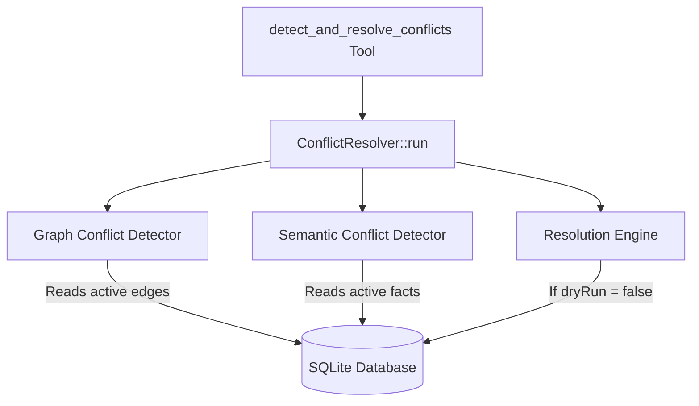

# Spec: Conflict Resolution Engine (Task 3.3)

> **Date:** 2026-06-26  
> **Status:** Approved  
> **Target Version:** 0.1.5  

This document specifies the design for the **Conflict Resolution Engine** in `openmemory_rs`. It details the algorithmic detection of contradictions within Graph and Semantic memory layers, and provides automated strategies to resolve them, exposing these capabilities via the `detect_and_resolve_conflicts` MCP tool.

---

## 1. Objectives & Requirements

### 1.1 Context
As AI agents query and write to their cognitive memory engine, they frequently encounter contradictory information (e.g., status changes, updated preferences, or corrected facts). To maintain memory integrity, the system needs to detect these conflicts and reconcile them.

### 1.2 Requirements
1. **Lightweight & High Efficiency**: Minimize CPU and RAM overhead by doing scope-specific database filtering and optimized SIMD-friendly vector operations.
2. **Deterministic Detection**:
   - **Graph Layer**: Use a list of *exclusive* relation types. Flag a conflict if an entity has multiple active edges with the same exclusive relation type but pointing to different target entities.
   - **Semantic Layer**: Retrieve active semantic facts in scope and compute pairwise cosine similarity. Flag pairs with similarity $\ge$ threshold (default `0.85`) as conflicts.
3. **Resolution Strategies**:
   - **Recency**: The record with the later `valid_from` wins.
   - **Confidence/Importance**: The graph edge with higher `confidence` wins; the semantic fact with higher `importance` wins.
4. **Tool Support**: Expose a new MCP tool `detect_and_resolve_conflicts` supporting a `dryRun` option (defaulting to `true`) to report conflicts before applying changes.

---

## 2. Component Design



### 2.1 Graph Layer Detection
We query active edges (`valid_until IS NULL`) filtered by the provided scope parameters (`user_id`, `session_id`, `agent_id`).
- Group the retrieved edges by `(from_name, relation_type)`.
- For any group where `relation_type` matches one of the exclusive relations (`"lives_in"`, `"current_job"`, `"spouse"`, `"has_status"`, `"is_born_in"`, `"located_in"`):
  - If the group has multiple entries with different `to_name` targets, every unique pair of mismatching targets is flagged as a `ConflictDetails::Graph`.

### 2.2 Semantic Layer Detection
We retrieve all active facts (`valid_until IS NULL`) in the given scope, loading only their `node_id`, `raw_text`, `embedding` blob, `valid_from` timestamp, and `importance` score.
- Deserialize each embedding blob (`Vec<u8>`) to a vector of `f32`s.
- Perform a pairwise comparison for all active facts using a compiler-friendly, SIMD-friendly cosine similarity dot product:
  ```rust
  let dot_product = v1.iter().zip(v2.iter()).fold(0.0, |acc, (x, y)| acc + x * y);
  ```
- If the similarity of two distinct facts exceeds the `semantic_threshold` (default `0.85`), they are flagged as `ConflictDetails::Semantic`.

### 2.3 Resolution Strategy Mapping
When resolving a conflict between **Record A** and **Record B**:

#### **Recency Strategy**
- Compare the `valid_from` timestamps as strings (ISO 8601 formatting guarantees ASCII sorting matches chronological sorting).
- The later timestamp wins. The older record is marked as the loser.

#### **Confidence / Importance Strategy**
- **Graph**: Compare `confidence`. The edge with higher confidence wins (falls back to recency on a tie).
- **Semantic**: Compare `importance`. The fact with higher importance wins (falls back to recency on a tie).

#### **Resolving Mutation**
For the losing record, if `dryRun` is `false`:
- Set `valid_until = strftime('%Y-%m-%dT%H:%M:%SZ', 'now')`.
- Set `superseded_by = winner_id` (node ID for semantic, or edge key description for graph).

---

## 3. Data Structures & Tool Schema

### 3.1 Serialization Structs
```rust
#[derive(Debug, Clone, serde::Serialize, serde::Deserialize, schemars::JsonSchema)]
#[serde(tag = "type", rename_all = "camelCase")]
pub enum ConflictDetails {
    Graph {
        from_name: String,
        relation_type: String,
        existing_target: String,
        new_target: String,
        existing_edge_key: String,
        new_edge_key: String,
    },
    Semantic {
        fact_id_a: String,
        fact_id_b: String,
        text_a: String,
        text_b: String,
        similarity: f64,
    },
}

#[derive(Debug, Clone, serde::Serialize, serde::Deserialize, schemars::JsonSchema)]
#[serde(rename_all = "camelCase")]
pub struct ConflictPair {
    pub id: String, // UUID representing the conflict
    pub details: ConflictDetails,
}

#[derive(Debug, Clone, serde::Serialize, serde::Deserialize, schemars::JsonSchema)]
#[serde(rename_all = "camelCase")]
pub struct ResolutionAction {
    pub conflict_id: String,
    pub resolved: bool,
    pub action_taken: String,
    pub winner_id: String,
    pub loser_id: String,
}

#[derive(Debug, Clone, serde::Serialize, serde::Deserialize, schemars::JsonSchema)]
#[serde(rename_all = "camelCase")]
pub struct ConflictResolutionReport {
    pub conflicts_found: usize,
    pub resolutions_applied: Vec<ResolutionAction>,
    pub dry_run: bool,
}
```

---

## 4. Testing & Verification

1. **Unit Tests**:
   - `test_graph_conflict_detection`: Seed conflicting graph edges (e.g. `lives_in -> NY` and `lives_in -> LA`). Verify that detection returns correct conflict details and resolving under "recency" / "confidence" updates the SQLite database correctly.
   - `test_semantic_conflict_detection`: Seed semantically duplicate facts (e.g. "User lives in New York" and "User lives in NYC" with $0.90$ cosine similarity). Verify that detection identifies them and resolution soft-deletes the losing record.
2. **Integration Test**:
   - Call the new `detect_and_resolve_conflicts` MCP tool over the gRPC endpoint in `tests/test_grpc.rs`, ensuring it returns a valid JSON-RPC response with zero errors.
