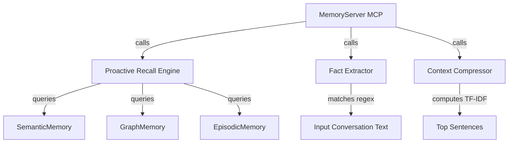

# Context Intelligence & Agent Optimization Design Spec

This document specifies the design, algorithms, schemas, and interfaces for **Phase 6: Context Intelligence & Agent Optimization** in `openmemory_rs`.

## 1. Overview & Goals

Phase 6 aims to optimize the context window and recall efficiency for AI agents interacting with `openmemory_rs`:
1. **Fact Extraction**: Automatically parsing unstructured chat logs or text to identify entities and relations (e.g. `Alice works with Rust`) without LLMs.
2. **Proactive Memory Recall**: Querying, rank-fusing, and attributing matching context from semantic, graph, and episodic layers given a current context.
3. **Context Compression**: Ranking sentences using an offline TF-IDF and Porter Stemmer score, removing common English stop words, and deduplicating to compress context windows.

All computations are done **100% offline, locally, and algorithmically** in pure Rust.

---

## 2. Architecture & Data Structures

We will introduce a new module `src/extraction/mod.rs` containing:
- `src/extraction/fact_extractor.rs`: Handles regex-based entity-relation extraction.
- `src/extraction/compressor.rs`: Handles local TF-IDF sentence scoring, stop-word filtering, and context compression.
- `src/extraction/recall.rs`: Handles multi-layer proactive retrieval and fusion.



### 2.1 Extraction Structures

```rust
#[derive(Debug, serde::Serialize, serde::Deserialize, schemars::JsonSchema, Clone)]
#[serde(rename_all = "camelCase")]
pub struct ExtractedFact {
    pub from: String,
    pub relation: String,
    pub to: String,
}

#[derive(Debug, serde::Serialize, serde::Deserialize, schemars::JsonSchema, Clone)]
#[serde(rename_all = "camelCase")]
pub struct ExtractionReport {
    pub facts_extracted: u32,
    pub stored: u32,
    pub duplicates_skipped: u32,
}

#[derive(Debug, serde::Serialize, serde::Deserialize, schemars::JsonSchema, Clone)]
#[serde(rename_all = "camelCase")]
pub struct CompressedResult {
    pub compressed_text: String,
    pub original_sentences: u32,
    pub compressed_sentences: u32,
    pub compression_ratio: f64,
}

#[derive(Debug, serde::Serialize, serde::Deserialize, schemars::JsonSchema, Clone)]
#[serde(rename_all = "camelCase")]
pub struct RecallItem {
    pub layer: String,
    pub content: String,
    pub confidence: f64,
    pub metadata: Option<serde_json::Value>,
}
```

---

## 3. Algorithm Specifications

### 3.1 Fact Extraction (`src/extraction/fact_extractor.rs`)
To extract facts from conversation text:
1. Split text into sentences using `UnicodeSegmentation::unicode_sentences` or standard punctuation splitting.
2. Filter sentences and match against precompiled regex patterns representing common relations:
   * `uses` / `using`: `(\w+)\s+(?:uses?|using)\s+(\w+)`
   * `depends_on` / `requires`: `(\w+)\s+(?:depends?\s+on|requires?)\s+(\w+)`
   * `prefers` / `likes`: `(\w+)\s+(?:prefers?|likes?|favours?)\s+(\w+)`
   * `is_a`: `(\w+)\s+(?:is\s+a|is\s+an|is\s+the)\s+(\w+)`
   * `works_with` / `works_at`: `(\w+)\s+(?:works?\s+(?:on|with|at))\s+(\w+)`
   * `created` / `built`: `(\w+)\s+(?:created?|built?|wrote?)\s+(\w+)`
3. Normalize capitalization: if matching group contains a lowercase common noun, ignore. Keep proper names or technical identifiers (which can start with capitalized or lowercase letters but must not be plain stop words).
4. Run similarity checks against the active database graph to prevent duplicates before storing.

### 3.2 Proactive Memory Recall (`src/extraction/recall.rs`)
Given `current_context`:
1. Query **Semantic Memory** for similar facts.
2. Query **Graph Memory** using FTS keyword searches or node observations lookup.
3. Query **Episodic Memory** for relevant reflection cards matching keywords.
4. Normalize scores to `[0.0, 1.0]`.
5. Combine and sort the items by score. If a memory appears in multiple layers, boost its confidence score.

### 3.3 Context Compression (`src/extraction/compressor.rs`)
Given `text` and `target_ratio` (e.g. `0.5` for 50% compression):
1. Split the document into sentences.
2. For each sentence:
   - Tokenize into lowercase words.
   - Remove common English stop-words (from a static list of ~150 words).
   - Stem each remaining word using `rust-stemmers` (Porter stemmer).
3. Compute the term frequencies (TF) of terms within each sentence:
   $$\text{TF}(t, s) = \frac{\text{Count of } t \text{ in } s}{\text{Total terms in } s}$$
4. Compute the inverse document frequency (IDF) of terms across all sentences of the text:
   $$\text{IDF}(t) = \ln\left(1 + \frac{\text{Total sentences}}{\text{Number of sentences containing } t}\right)$$
5. Score each sentence by summing the TF-IDF scores of its constituent terms:
   $$\text{Score}(s) = \sum_{t \in s} \text{TF}(t, s) \times \text{IDF}(t)$$
6. Sort sentences by score descending, keep top $N = \text{Total Sentences} \times \text{target\_ratio}$.
7. Reconstruct the document by printing kept sentences in their original order.

---

## 4. MCP Tools Schema

We will expose the following 3 new tools:

### 4.1 `extract_and_store_facts`
```json
{
  "name": "extract_and_store_facts",
  "description": "Extract entities and relation triples from conversation text and save to knowledge graph",
  "inputSchema": {
    "type": "object",
    "properties": {
      "conversationText": { "type": "string" },
      "userId": { "type": "string" },
      "sessionId": { "type": "string" },
      "agentId": { "type": "string" }
    },
    "required": ["conversationText"]
  }
}
```

### 4.2 `proactive_recall`
```json
{
  "name": "proactive_recall",
  "description": "Proactively retrieve and fuse relevant context from all memory layers based on a prompt",
  "inputSchema": {
    "type": "object",
    "properties": {
      "currentContext": { "type": "string" },
      "maxResults": { "type": "integer" },
      "userId": { "type": "string" },
      "sessionId": { "type": "string" },
      "agentId": { "type": "string" }
    },
    "required": ["currentContext"]
  }
}
```

### 4.3 `compress_context`
```json
{
  "name": "compress_context",
  "description": "Compress unstructured context using local TF-IDF sentence extraction",
  "inputSchema": {
    "type": "object",
    "properties": {
      "text": { "type": "string" },
      "targetRatio": { "type": "number" }
    },
    "required": ["text"]
  }
}
```
