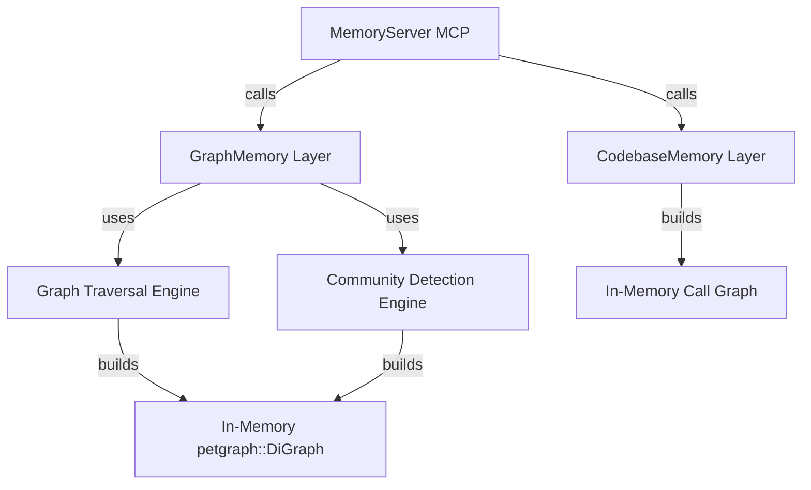

# Graph Intelligence Design Specification

This document specifies the architecture, data models, algorithms, and interfaces for **Phase 5: Advanced Graph Intelligence** in `openmemory_rs`.

## 1. Overview & Goals

Phase 5 extends `openmemory_rs` with advanced cognitive graph intelligence, allowing:
* **Multi-hop Graph Traversal**: Traversing entity-relation links using BFS, shortest-path calculation, and relation-chain following.
* **Community Detection**: Finding clusters of highly-related entities and summarizing their contents structurally.
* **Recursive Code Impact Analysis**: Mapping static codebase call-graphs to calculate the risk and depth of impact when code changes.

All computations are done **100% offline, locally, and algorithmically** without external LLM/API calls.

---

## 2. Architecture & Data Structures

We will introduce a new module `src/layers/graph_traversal.rs` and a new module `src/search/community.rs` to handle these capabilities.



### 2.1 Graph Traversal Structures (`src/layers/graph_traversal.rs`)

```rust
#[derive(Debug, serde::Serialize, serde::Deserialize, schemars::JsonSchema, Clone)]
#[serde(rename_all = "camelCase")]
pub struct TraversalStep {
    pub entity_name: String,
    pub relation_type: String,
    pub depth: u32,
}

#[derive(Debug, serde::Serialize, serde::Deserialize, schemars::JsonSchema, Clone)]
#[serde(rename_all = "camelCase")]
pub struct PathResult {
    pub path: Vec<String>,
    pub relations: Vec<String>,
}
```

### 2.2 Community Detection Structures (`src/search/community.rs`)

```rust
#[derive(Debug, serde::Serialize, serde::Deserialize, schemars::JsonSchema, Clone)]
#[serde(rename_all = "camelCase")]
pub struct Community {
    pub id: u32,
    pub members: Vec<String>,
    pub summary: String,
}
```

### 2.3 Code Impact Structures (Inside `src/layers/codebase.rs`)

```rust
#[derive(Debug, serde::Serialize, serde::Deserialize, schemars::JsonSchema, Clone)]
#[serde(rename_all = "camelCase")]
pub struct ImpactReport {
    pub affected_symbols: Vec<String>,
    pub max_depth: u32,
    pub risk_score: f64,
    pub details: String,
}
```

---

## 3. Heuristic Algorithms

### 3.1 Multi-hop Graph Traversal
Active edges (where `valid_until IS NULL`) are queried under the specified scope:
```sql
SELECT from_name, to_name, relation_type 
FROM graph_edges 
WHERE valid_until IS NULL 
  AND (user_id = ?1 OR user_id = '*')
  AND (session_id = ?2 OR session_id = '*')
  AND (agent_id = ?3 OR agent_id = '*');
```
A directed graph is constructed using `petgraph::graph::DiGraph<String, String>`.
* **`bfs_traverse`**: Uses a queue-based loop starting from `start_node`. Limits depth to `max_depth`.
* **`shortest_path`**: Uses simple BFS pathfinding to compute path nodes and relation types between two entities.
* **`relation_chain`**: Step-by-step path following matching the relation types in the target chain.

### 3.2 Community Detection
* The in-memory graph is converted to an undirected representation.
* We find connected components using `petgraph::algo::tarjan_scc` (strongly connected components on undirected graph is equivalent to connected components).
* For each component, we extract the observations from `graph_nodes` for all constituent entities.
* We rank and count keywords in observations to produce a summary:
  `"Community focused on [members]. Themes: [extracted observation snippets]."`

### 3.3 Code Impact Analysis
* Nodes correspond to code element IDs. Directed edges represent callers/callees.
* Query all `code_elements` and `code_calls` in the current scope.
* Build a `petgraph::graph::DiGraph<String, ()>`.
* Traverse backwards (edges from callee to caller) using BFS to find transitive callers.
* Compute a risk score:
  $$\text{Risk Score} = \text{Min}(1.0, 0.1 \times \text{direct\_callers} + 0.05 \times \text{transitive\_callers} + 0.1 \times \text{max\_depth})$$

---

## 4. MCP Tools Exposed

We will expose 4 new MCP tools:
1. `traverse_graph`: Traverses the graph from a start node up to `max_depth`.
2. `find_path`: Finds the shortest path and relations between two entity nodes.
3. `analyze_graph_communities`: Segments the graph into communities and summarizes them.
4. `analyze_code_impact`: Analyzes the transitive downstream caller impact of changing a symbol or file.
